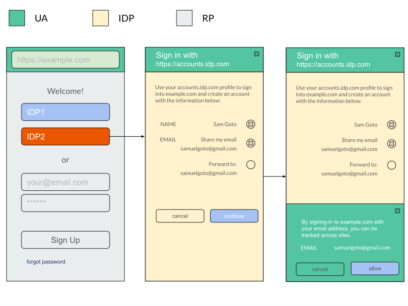
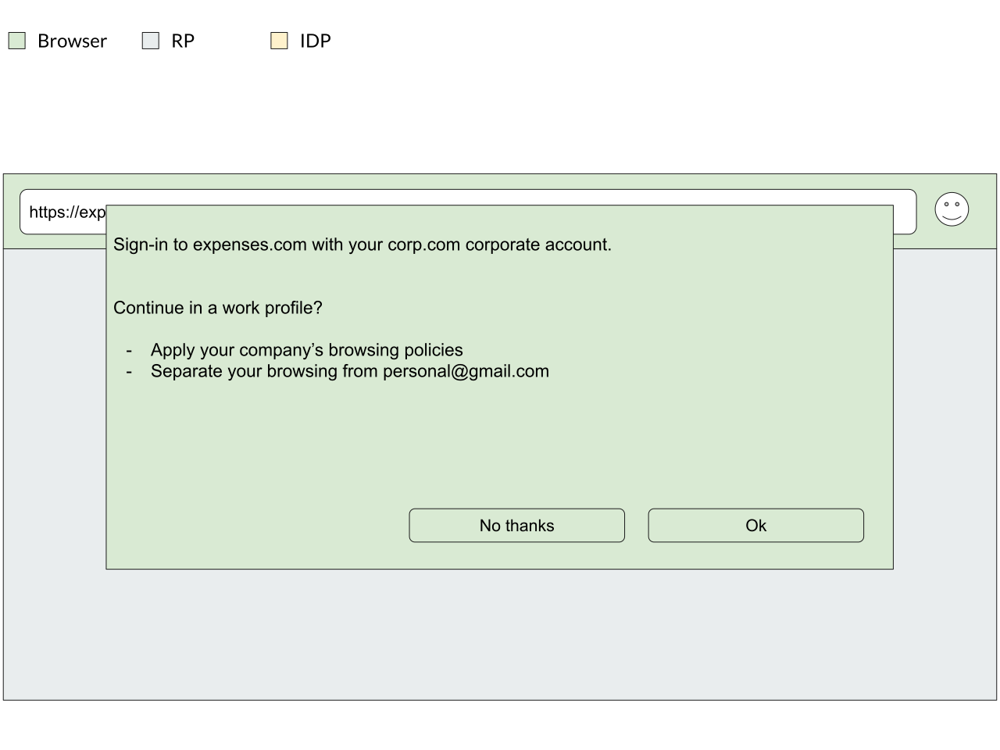
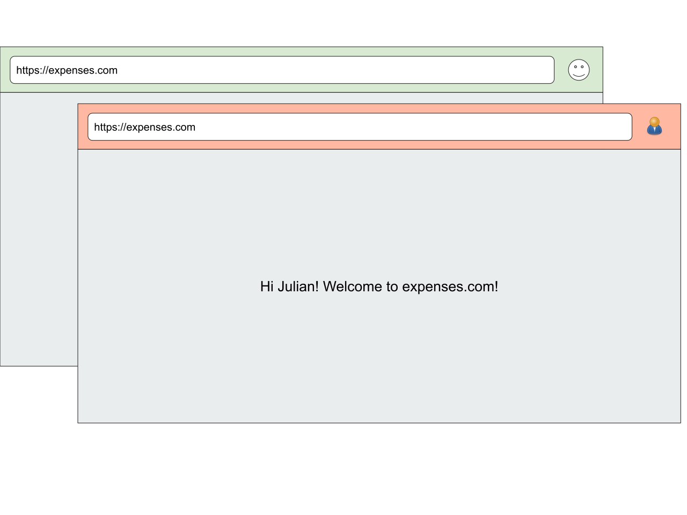

**TL;DR**; This is an **active** exploration to proactively **preserve** and **elevate** identity federation (e.g. Sign-in with X), **forwards compatible** with a more **private** web.

This explainer is broken down into:

- [Why](#the-problem) is federation under threat?
- [What](#the-anatomy-of-federation) is under threat?
- [How](#classification) do we preserve and extend it?
- [When](#roadmap) does this happen?

# The Problem

Over the last decade, identity federation has unquestionably played a central role in raising the bar for authentication on the web, in terms of ease-of-use (e.g. passwordless single sign-on), security (e.g. improved resistance to phishing and credential stuffing attacks) and trustworthiness compared to its preceding pattern: per-site usernames and passwords.

The standards that define how identity federation works today were built independently of the web platform (namely, [SAML](https://en.wikipedia.org/wiki/Security_Assertion_Markup_Language), [OpenID](https://en.wikipedia.org/wiki/OpenID) and [OAuth](https://en.wikipedia.org/wiki/OAuth)), and their designers had to work **around** its limitations rather than extending them (notably, rightfully so at the time).

Because of that, existing user authentication flows rely on general web capabilities such as top-level navigations/redirects with parameters, window popups and cookies.

Because these general purpose primitives can be used for an open ended number of use cases (again, notably, by design), browsers have to apply policies that capture the **lowest common denominator** of abuse, at best applying cumbersome permissions (e.g. popup blockers) and at worst entirely blocking them (for example, [here](https://github.com/michaelkleber/privacy-model)).

Over the years, as these low level primitives get abused, browsers intervene and federation adjusts itself. For example, popup blocks became common and federation had to adjust itself to work in a world where popups blockers were widely deployed:


The challenge, now more than ever, is that some of these low level primitives are getting increasingly abused to allow users on the web to be tracked. So, as a result, browsers are applying strictier and stricter policies around them.

If browsers are applying stricter policies around them, and assuming that federation is safer than usernames/passwords, how do we keep identity federation around?

# The classification problem

The problem starts with what we have been calling the classification problem.

When federation was first designed, it was rightfully designed **around** the existing capabilities of the web, rather than **changing** them. Specifically, federation worked with callbacks on top of **cookies**, **redirects** or **popup windows**, which didn't require any redesign, redeployment or negotiation with browser vendors.

Federation makes use of redirects to navigate the user to identity providers (with callbacks, e.g. `redirect_uri`), which upon permission redirects users again to the relying parties with a result (e.g. an `id_token`):


These **general purpose** primitives enabled a variety of use cases, which include, among other things, federation. However, unfortunately, they also enable cross-site communication, namely via [decorating links](https://www.chromium.org/Home/chromium-privacy/privacy-sandbox), which can be used to track users without their awareness in what's called **bounce tracking**:


In this formulation of **bounce tracking**, websites redirect the user to cross-origin websites that automatically and invisibly redirect the user back to the caller, but passing enough information in URL parameters that allows the tracker to join that visit (e.g. when you visit rings.com) with visits in other websites (e.g. when you visit shoes.com).

In federation, that's less invisible/automatic, but it is still there. Cross-site tracking is enabled via federation when relying parties that the user signs in to **collude** with each other (and other entities) to deterministically (or probabilistically) **link** their user's accounts to build and get access to a richer user profile (e.g. one site selling data on browsing history for ads targeting to another service). While this could be enabled without federation per se (user could manually provide a joinable email address or phone number), federated identity providers have an opportunity to address this problem at scale by providing their users with site-specific/directed identifiers. 


Another example of a low level primitive that federation depends on are **iframes** and **third party cookies**. Iframes are often embedded into relying parties assuming they'll have access to third party cookies which are then used for personalization (e.g. showing names in login buttons). Unfortunately, that's virtually indistinguishable from trackers that can track your browsing history across relying parties, just by having users visit links (e.g. loading credentialed iframes on page load):


Because of the tracking risk, browsers are starting to disable third party cookies in iframes.

Because these cross-site communication takes place in a general purpose medium, it is hard for browsers to distinguish between cross-site communication that is used for exchanging identity data or other cases where intervention is needed.

Browsers can't **classify** federation, hence the name.

The classification problem is notably hard because it has to deal with **adversarial impersonation**: agents who have the interest in being classified as federation to get access to browser affordances.

So, how do we **distinguish** federation from tracking and elevate the level of **control** while **assuming** adversarial impersonation?

# The Anatomy of Federation

Before we can answer "how to distinguish" federation from tracking, lets first try to understand what federation depends on. For our interest, we can identify three big passes:

1. There is a convention used by relying parties to request identification/authentication to identity providers
1. There is a convention used by identity providers to respond with identification/authentication to relying parties
1. It uses browser affordances for personalization

These passes rely on the following low level primitives:

- **HTTP APIs** (i.e. redirects, top level navigations, `<a>` or `window.location.location`),
- **JS APIs** (i.e. popups with `window.open` and `postMessage`) or
- **HTML APIs** (i.e. personalized buttons using `<iframe>`)

For example, a relying party can use the OpenID convention to request to an IDP:

```html
<a href="https://idp.example/?client_id=1234&scope=openid&redirect_uri=https://rp.example/callback.php">Sign in with IDP</a>
```

Which it then expects the IDP to at some point use the second convention to return back a response to the `redirect_uri`:

```http
POST /callback.php HTTP/1.1
Host: rp.example.com
Content-Type: application/x-www-form-urlencoded
Content-Length: length
Accept-Language: en-us
Accept-Encoding: gzip, deflate
Connection: Keep-Alive

id_token={JWT}
```

Another common affordance that federation uses are popups:

```javascript
let popup = window.open(`https://idp.example/?client_id=1234&scope=openid&redirect_uri=rp.example`);
window.addEventListener(`message`, (e) => {
  if (e.origin == "https://idp.example") {
    // ...
    e.source.postMessage("done, thanks");
  }
});
```

Or iframes:

```html
<iframe src="https://idp.example/?client_id=1234&scope=openid&redirect_uri=rp.example"></iframe>
```

Which listen to postMessages:

```javascript
window.addEventListener(`message`, (e) => {
  if (e.origin == "https://idp.example") {
    // ...
    e.source.postMessage("done, thanks");
  }
});
```

All of these affordances allow for arbitrary cross-origin communication, so at some point we can expect them to be constrained (more details [here](https://www.chromium.org/Home/chromium-privacy/privacy-sandbox)).

# Classification

Like we said above, the classification problem is the browser's inability to distinguish identity federation from tracking due to the fact that both use low level primitives (namely, redirects, popups, iframes and cookies) and its consequence is the application of lowest common denominator policies.

The first thought that occurred to us was to look into each of these low-level primitives and offer for each an indentity-specific high-level affordance, **trading generality for awareness**.

With that in mind, lets look into each specific low-level primitive and what a high-level identity-specific affordance would look like.

## The HTTP API

One of the most basic things that we could do to classify federation is to detect patterns in HTTP requests.

Because a significant part of federation is deployed over well-established protocols (e.g. OpenID, SAML), their HTTP profile is somewhat easy to spot. For example, for OpenID Connect requests/responses we could look at HTTP requests that have:

- a **client_id** parameter
- a **redirect_uri** parameter
- a **scope** parameter
- an accompanying **.well-known/openid-configuration** configuration

Responses can be matched when they match:

- a redirect to the previously used **redirect_uri**
- an **id_token** parameter

It is an active area of investigation to determine:

1. which and how many of these patterns we would want to use (too few and you over-classify, too many and you under-classify),
1. whether the same approach would work for other protocols (e.g. SAML).
1. whether we need an opt-in / explicit API and if so which (e.g. perhaps a special URL marker, like a reserved URL parameter or a scheme)

## The JS API

Popups are harder to classify because each IDP seems to use a custom protocol to open the popup as well as to communicate via postMessage.

It is hard to know what that will exactly look like right now, but as a starting point, here is what it could look like.

Instead of the low level `window.open` and listening to `window` events, one coule write at a high-level:

```javascript
// This is just a possible starting point, largely TBD.
let {idToken} = await navigator.credentials.get({
  provider: "https://accounts.example.com",
  // other OpenId connect parameters
});
```

And instead of the low level `postMessage`, the IDP would write:

```javascript
// This is just a possible starting point, largely TBD.
await navigator.credentials.store({
  idtoken: JWT,
});
```

## The HTML API

Relying Parties also typpically embed iframes served by identity providers for personalization (e.g. showing the user's profile picture / name on buttons). Browsers do (or are intending to) block third party cookies in iframes, making them uncredentialed and hence unable to personalize.

This is still under active exploration, but our efforts are going into exploring ways in which we can leverage [fencedframes](https://github.com/shivanigithub/fenced-frame) and one of the response APIs above.

For example, we are looking into ways we could replace the `<iframe>` tag with the web-bundle version of `<fencedframe>`s:

```html
<fencedframe src="https://idp.example/personalized-frame.wbn" client_id="1234" scope="openid email">
</fencedframe>
```

In this formulation, the web bundle is a static (yet personalized) bundle that can be displayed on page load but can't have any uncontrolled communication outwards (e.g. over the network or over in-browser features, like postMessage).

Once the user interacts with the fencedframe, a user agent would know, based on identity-specific parameters in the fencedframe, when to release that information to the web bundle as well as use the APIs above (e.g. the HTTP API or the JS API) to return an idtoken back.

```javascript
window.addEventListener(`message`, (e) => {
  if (e.origin == "https://idp.example") {
    // ...
    e.source.postMessage("done, thanks");
  }
});
```

# Control

Now, clearly, addressing the classification problem is necessary but not sufficient. There are a couple of problems that needs to be solved too:

1. adversarial impersonation
1. the lack of privacy controls

The first thing to consider is that an adversarial tracker can and will use any of the affordances that will allow them to break out of the privacy sandbox. So, the high level APIs need to implemented in such a way that prevents that from happening.

In many ways, the first problem is related to the second one: if user agents expose clear privacy controls, then uncontrolled tracking cannot happen.

There is a variety of privacy controls that we are exploring, but just as a baseline, take the [permission-oriented](consumers.md#the-permission-oriented-variation) variation:



In this variation, we offer the user the identity-specific controls whenever cross-site identity-specific communication is conducted (e.g. from the relying party to the IDP and vice versa), based on our ability to [classify](#classification).

This variation isn't perfect: while it is backwards compatible with most of the deployment of federation, we believe it leaves something be desired on user experience.

For one, the user has to make two determinations (on the consequences of tracking) that are unrelated to the job to be done (sign-in), which leads us to the [mediation-oriented](consumers.md#the-mediation-oriented-variation) variation (which comes with trade-offs too).

For two, the user has to make a determination altogether (one that we believe is unnecessary), which leads us to the [delegation-oriented](consumers.md#the-delegation-oriented-variation) variation (which, again, comes with its set of trade-offs too).

## Enterprise

To the best of our knowledge, we believe that business users (employees of a corporation) have a different set of privacy expectations compared to consumers, in that the accounts issued to employees are owned by the businesses (as opposed to the relationship a consumer has with social login providers). It is also clear to us too that the current deployment of businesses makes a non-trivial use of personal machines owned by employees, rather than machines that are issued by the business (which have a much easier ability to control enterprise policies).

We believe that the controls should take that distinction into consideration, and that the biggest challenge is adversarial impersonation.



This is still an active area of exploration, but to give a sense of direction, we are actively exploring making an abrupt separation between personal profiles and work profiles. The intuition here is that browser profiles are the closest delineation that can make a separation between personal use of your browser versus work use of your browser, along with the privacy expectations in each mode.



In addition to the separation, and with the user's permission/control/understanding, it seems like it would be beneficial for business admins to have the ability to set work policies on a per-profile basis.

# Roadmap

# Further Reading

The following should give you a deeper understanding of the problem, related problems and how they were tackled in the past:
  
- [Prior Art](prior.md)
- [The Threat Model](privacy_threat_model.md): a formalization of the problem
- [Related Problems](problems.md) and **desirable side effects**
