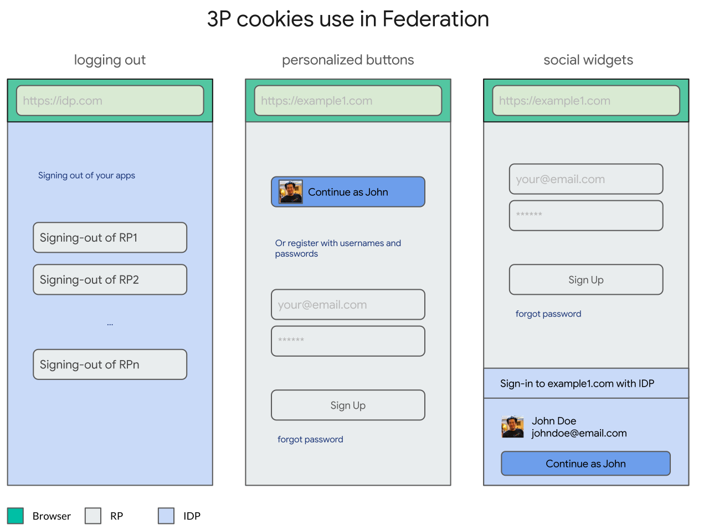
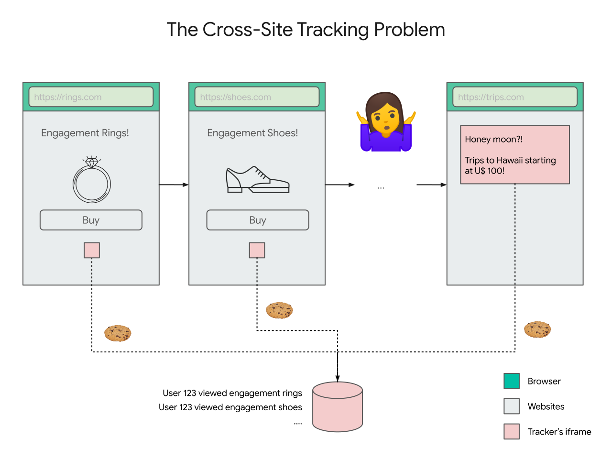
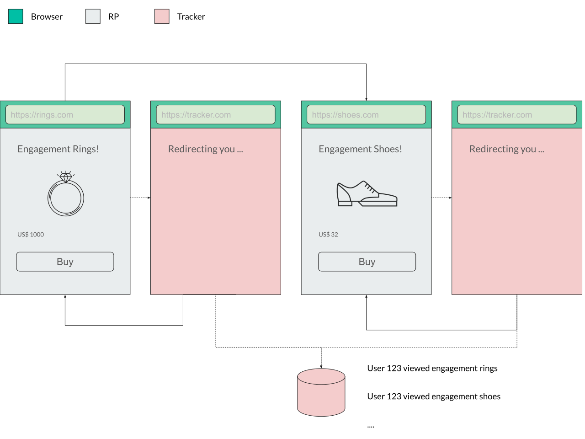
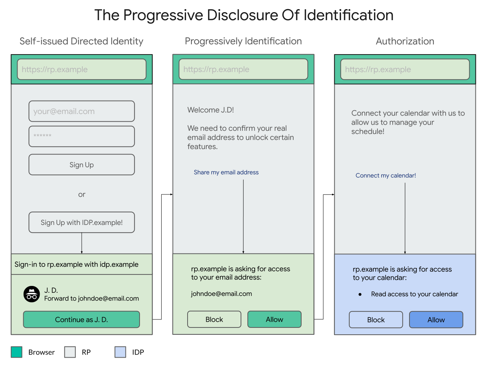

> not to be confused with [this](https://www.w3.org/2005/Incubator/webid/spec/) WebID whose authors have [graciously](https://github.com/WICG/WebID/issues/54#issuecomment-783605484) allowed us to use this as a codename until we [find](https://github.com/WICG/WebID/issues/41#issuecomment-712304910) a better one

**TL;DR**; This is an **active** exploration to react to the **ongoing** privacy-oriented changes in browsers (e.g. [1](https://webkit.org/blog/10218/full-third-party-cookie-blocking-and-more/), [2](https://blog.mozilla.org/blog/2019/09/03/todays-firefox-blocks-third-party-tracking-cookies-and-cryptomining-by-default/) and [3](https://blog.google/products/chrome/privacy-sustainability-and-the-importance-of-and/)) and **preserve** and **elevate** identity federation (e.g. OpenID, OAuth and SAML) for a more private Web.

This explainer is divided in three sections:

1. [Where we are](#the-problem)
1. [Where we ought to be](#the-end-state)
1. [How do we get there](#sequencing)

# The Problem

Over the last decade, identity federation has unquestionably played a central role in raising the bar for authentication on the web, in terms of ease-of-use (e.g. passwordless single sign-on), security (e.g. improved resistance to phishing and credential stuffing attacks) and trustworthiness compared to its preceding pattern: per-site usernames and passwords.

The standards that define how identity federation works today on the Web were built independently of the Web Platform (namely, [SAML](https://en.wikipedia.org/wiki/Security_Assertion_Markup_Language), [OpenID](https://en.wikipedia.org/wiki/OpenID) and [OAuth](https://en.wikipedia.org/wiki/OAuth)), and their designers had to (rightfully so) work **around** its limitations rather than extend them.

Because of that, existing user authentication flows were designed on top of general-purpose web platform capabilities such as top-level navigations/redirects with parameters, window popups, iframes and cookies.

However, because these general purpose primitives can be used for an open ended number of use cases (again, notably, by design), browsers have to apply policies that capture the **lowest common denominator** of abuse, at best applying cumbersome permissions (e.g. popup blockers) and at worst entirely blocking them (e.g. [blocking](https://webkit.org/blog/10218/full-third-party-cookie-blocking-and-more/) third party cookies).

Over the years, as these low level primitives get abused, browsers intervene and federation adjusts itself. For example, popup blockers became common and federation had to adjust itself to work in a world where popups blockers were widely deployed.

The challenge, now more than ever, is that some of these low level primitives are getting increasingly abused to allow users on the web to be tracked. So, as a result, browsers are applying stricter and stricter policies around them.

> Publicly announced browser positions on third party cookies:
>
> 1. [Safari](https://webkit.org/blog/10218/full-third-party-cookie-blocking-and-more/): third party cookies are **already** blocked by **default**
> 1. [Firefox](https://blog.mozilla.org/blog/2019/09/03/todays-firefox-blocks-third-party-tracking-cookies-and-cryptomining-by-default/): third party cookies are **already** blocked **by a blocklist**, and
> 1. [Chrome](https://blog.google/products/chrome/privacy-sustainability-and-the-importance-of-and/): on iOS **already** blocked **by default** and intends to offer **alternatives** to make them **obsolete** in the [near term](https://www.blog.google/products/chrome/building-a-more-private-web/) in other platforms.

Blocking third party cookies broke important parts of the protocols in those browsers (e.g. [logouts](https://www.identityserver.com/articles/the-challenge-of-building-saml-single-logout)) and made some user experiences inviable (e.g. social [button](https://developers.facebook.com/docs/facebook-login/userexperience/) and [widget](https://developers.google.com/identity/gsi/web) personalization). 

While it is clearer to see the **current** impact of third party cookies, it is equally important to understand the ways in which the low level primitives that identity federation depends on (e.g. redirects) are being abused and the [principles](https://github.com/michaelkleber/privacy-model) browsers are using to control them, so that we don't corner ourselves into another dead end.

If browsers are applying stricter policies around the low level primitives that federation depends on, and under the assumption that federation is significantly better than usernames/passwords, how do we keep identity federation around?

## Third Party Cookies

The problem starts with what we have been calling the classification problem.

When federation was first designed, it was rightfully designed **around** the existing capabilities of the web, rather than **changing** them. Specifically, federation worked with callbacks on top of **cookies**, **redirects**, **iframes** or **popup windows**, which didn't require any redesign, redeployment or negotiation with browser vendors.

One example of a low level primitive that federation depends on are **iframes** and **third party cookies**. For example, credentialed iframes are used while [logging out](https://openid.net/specs/openid-connect-rpinitiated-1_0.html) and social [button](https://developers.facebook.com/docs/facebook-login/userexperience/) and [widget](https://developers.google.com/identity/one-tap/web) personalization.



Unfortunately, that's virtually indistinguishable from trackers that can track your browsing history across relying parties, just by having users visit links (e.g. loading credentialed iframes on page load).

We call this **the classification problem** because it is hard for a browser to programatically distinguish between these two different cases: identity federation helping a user versus users being tracked without any control.



Third party cookies are **already** blocked in [Safari](https://webkit.org/blog/10218/full-third-party-cookie-blocking-and-more/) and [Firefox](https://blog.mozilla.org/blog/2019/09/03/todays-firefox-blocks-third-party-tracking-cookies-and-cryptomining-by-default/) **by default** (and [Chrome](https://blog.google/products/chrome/privacy-sustainability-and-the-importance-of-and/) intends to block that soon too) which make these use cases inviable.

The problems then are:

1. **First** and foremost, what Web Platform features need to be exposed to (re) enable these features of federation to co-exist with the absence of third party cookies in browsers going forward?
2. **Secondarily**, in which direction browsers are going that could potentially impact federation?

## Navigational Tracking

Before we prematuraly jump into solutions for the first (and more **urgent**) problem, we think there is something more fundamental changing. Lets take a step back and a closer look at the **second** problem: in which direction browsers are going that could more fundamentally impact federation?

While third party cookies in iframes are used in federation, a more fundamental low level primitive that federation uses is the use of top level navigations (e.g. redirects or form POSTs) to navigate the user to identity providers (with callbacks, e.g. `redirect_uri`) and back to relying parties with a result (e.g. an `id_token`):


However, unfortunately, this **low level** primitive also enable cross-site communication, namely via [decorating links](https://www.chromium.org/Home/chromium-privacy/privacy-sandbox), which can be abused to track users without their control in what's called **bounce tracking**:



In this formulation of **bounce tracking**, websites redirect the user to cross-origin websites that automatically and invisibly redirect the user back to the caller, but passing enough information in URL parameters that allows the tracker to join that visit (e.g. when you visit rings.com) with visits in other websites (e.g. when you visit shoes.com).

In federation, that's less invisible/automatic, but it is still there. Cross-site tracking is enabled via federation when relying parties that the user signs in to **collude** with each other (and other entities) to deterministically (or probabilistically) **link** their user's accounts to build and get access to a richer user profile (e.g. one site selling data on browsing history for ads targeting to another service). While this could be enabled without federation per se (user could manually provide a joinable email address or phone number), federated identity providers have an opportunity to address this problem at scale by providing their users with site-specific/directed identifiers. 


Because of these tracking risks, browsers are starting to disable third party cookies in iframes and more generally provide tighter control over cross-site communication (e.g. a [privacy model](https://github.com/michaelkleber/privacy-model) for the web).

Because these cross-site communication takes place in a general purpose medium, it is hard for browsers to distinguish between cross-site communication that is used for exchanging identity data deliberately (e.g. federation) or unintentionally (e.g. tracking).

Browsers can't **classify** federation, hence the name.

The classification problem is notably hard because it has to deal with **adversarial impersonation**: agents who have the interest in being classified as federation to get access to browser affordances.

While the timeline for link decoration is much farther in time, it much more fundamentally threatens federation.

> Publicly announced positions by browsers on bounce tracking:
>
> - Safari's existing deployed [strategies](https://webkit.org/blog/11338/cname-cloaking-and-bounce-tracking-defense/) and [principles](https://github.com/privacycg/proposals/issues/6)
> - Firefox's protection against [redirect tracking](https://blog.mozilla.org/security/2020/08/04/firefox-79-includes-protections-against-redirect-tracking/)
> - Chrome's stated [Privacy Model](https://github.com/michaelkleber/privacy-model) for the Web

So, how do we **distinguish** federation from tracking and elevate the level of **control** while **assuming** adversarial impersonation?

# Proposal

Clearly, this is a massive, multi-agent, multi-year problem across the board.

There aren't any easy solutions and most of the answers come in the form of alternatives with trade-offs.

There are billions of users that depend on federation on the web, millions/thousands of relying parties and thousands/hundreds of identity providers. There are also tens of browsers and operating systems, all moving independently. None of that changes overnight and we don't expect it to.

The specs that define how federation works (e.g. OpenID, SAML, etc) are intrincate and long (e.g. session management, authorization, etc).

Having said that, failing to be proactive about affecting change and making federation forward compatible with a more private Web can steer users to less secure patterns, like usernames/passwords or native apps.

The approach we have taken so far has been a combination of two strategies:

- a **firm** and **principled** understanding of where we want to get
- a well **informed**, **deliberate** and **pragmatic** choice of what steps to take us there

We believe a convincing path needs to have a clearly defined end state but also a plausible sequencing strategy.

1. Let's start with [where we want to be](#the-end-state), and then later
1. Go over [how we get there](#sequencing).

## The End State

In the future, we believe that identity federation on the Web needs to be **free of unintended tracking consequences**.

By that we mean that, in the future:

* **The RP Tracking Problem**: Websites shouldn't be able to join your identities by default and without your control
* **The IDP Tracking Problem**: Identity Providers shouldn't be able to be involved without justification by default and without your control


In the future, we'll have two fundamentally different things: consequence-free defaults and control. Identity federation on the a Web that is narrowly private by default and broadly identifying by choice.

> We don't believe these to be much different from the properties that Kim Cameron identified in the [7 laws of identity](https://www.identityblog.com/stories/2005/05/13/TheLawsOfIdentity.pdf), namely the "User Control and Consent", "Minimal Discosure for a Constrained Use", "Justifiable Parties" and the "Directed Identity" laws.

The principle that we'll use as a foundation to affect change on the defaults and controls is that cross-origin communication is a priviledged operation and needs to be intermediated by your user agent.

> When there is a conflict in interests of the parties involved, we think the following is the right order of constituencies: [users first](https://www.w3.org/TR/html-design-principles/#priority-of-constituencies), developers second (relying parties and identity providers, in that order), browser engines third and technical purity fourth.

In the future, your user agent will intermediate and assist in the cross-origin exchange of identification by picking better defaults in two ways:

1. **The RP Tracking Mitigation**: Unbundling your **global** identity into multiple **directed** identities per-site.
1. **The IDP Tracking Mitigation**: Unbundling the **issuing** of credentials with their **presentation**.


The first principle can be solved by the user agent insisting on a progressive disclosure of identification, starting with the minimal disclosure for the most constrained use (e.g. a directed identifier that is recoverable between devices) towards progressively and contextually exposing yourself (e.g. giving access to your calendar):



The second principle (unbundling the issuer from the holder of credentials) is more technically involved, but has a real world analog: driver's licenses.

When you present your driver's license as a form of identification to, say, a store that needs to check your age, the government issuer of the driver's license isn't involved (and its involvement doesn't seem to be justified): the **presentation** of your driver's license is decoupled from the **issuing** of your driver's license.

We believe that if we unbundle these operations, users can use their credentials without **necessarily** phone-homing to their issuers:


### The Delegation-oriented API

So far, none of these are original ideas. Proxying email addresses and directing identifiers is a norm for some identity providers and self-issuing credentials has been proposed by [BrowserID](prior.md) for example.

However, while these ideas exist in isolation, we are finding that a system that combines them is hard.

We call the active investigation for a protocol that can solve both of these problems (as well as recovery) the **Delegation-oriented Model**. Without much explanation (full details [here](https://docs.google.com/document/d/1ZymcC2ABSzwJloXje5R_KFLi0-Vaz03iLR9DjwQl9u0/edit)), here is a glimpse of what that may look like:


The **delegation-oriented model** is very compelling as an end-state for WebID because it solves both tracking problems. Because it does, it doesn't have any unintended tracking consequence.

Because it is **consequence-free**, we expect it to be **permission-less** (the best permission is that one that isn't needed) and comparably better for users with formulations that impose on the user to make a determination on the consequences of being tracked.

The **delegation-oriented model** isn't free of challenges though. Its weakest point is that it is (a) not backwards compatible with the current deployment of federation on the Web and (b) not perfectly clear to us if the incentives are well aligned to establish an economic equilibrium.

While not all of the pieces are quite put together, we think the delegation-oriented model represents well the northstar that we are aspiring to.

The problems we mentioned, as well as others, are being explored more in-depth [here](https://docs.google.com/document/d/1ZymcC2ABSzwJloXje5R_KFLi0-Vaz03iLR9DjwQl9u0/edit).

## The Intermediate States

There are a large number of mid-game states between the opening and the endgame for WebID.

It is unclear to us how many of these are sustainable / desirable long term and how they will evolve, but their existance for a non-trivial amount of time is non-neglectable.

For the most part, they are a trade-off between backwards compatibility (for users, relying parties and identity providers, in that order) and effective controls (ignorable permission prompts, mediation and removing the tracking risks altogether, in that order).

Our best guess at the moment is that each of these three variations (delegation, mediation and permission) have different trade-offs that don't put them at mutually exclusive positions, meaning that we could imagine an state where all of these three variations co-exist.

So, having said that, lets start from that order: from most backwards compatible to least.

* [The Permission-oriented API](#the-permission-oriented-api)
* [The Mediation-oriented API](#the-mediation-oriented-api)

### The Permission-oriented API

It is clearly highly desirable to minimize the deployment costs: the less we ask developers to change (while keeping/raising the privacy bar), the better.

That's what the HTTP API is all about: backwards compatibility.

We are still exploring this space, but we are trying to understand if it would be possible to classify federation with zero changes in the ecosystem.

Because a significant part of federation is deployed over well-established protocols (e.g. OpenID, SAML), their HTTP profile is somewhat easy to spot. For example, for OpenID Connect requests/responses we could look at HTTP requests that have:

- a **client_id** parameter
- a **redirect_uri** parameter
- a **scope** parameter
- an accompanying **.well-known/openid-configuration** configuration

In this formulation, a user engine would intercept HTTP requests made in this fashion and provide permission prompts to gather the user's intent to sign-in and hence, for example, allow the request to be made credentialed with cookies:


The way back from the IDP to the RP is also highly structured, so responses can be classified (and made credentialed) when they match:

- a redirect to the previously used **redirect_uri**
- an **id_token** parameter

Notably, for cases where the IDP controls the deployment of the JavaScript running on the RP page (typically opening a popup window), we are also exploring offering a more explicit API, such as:

```javascript
// This is just a possible starting point, largely TBD.
let {idToken} = await navigator.credentials.get({
  provider: "https://accounts.example.com",
  "ux_mode": "permission",
  // other OpenId connect parameters
});
```

So, to sum up:

* **pros**: most backward compatible approach
* **cons**: we don't expect permissions to be the most effective way to offer privacy controls

### The Mediated-oriented API

Another intermediate formulation that is somewhere in between in the spectrum of backwards compatibility and privacy control effectiveness, is what we've been calling the mediated-oriented API.

In this formulation, the triggering of the API works similarly as before, but the execution is done in an intermediated fashion:

```javascript
// This is just a possible starting point, largely TBD.
let {idToken} = await navigator.credentials.get({
  provider: "https://accounts.example.com",
  "ux_mode": "mediation",
  // other OpenId connect parameters
});
```

This is accomplished via an HTTP protocol between the IDP and the User-Agent (under exploration [here](HOWTO.md#identity-provider-implementation)):


The mediated-oriented API offers a balance between the trade-offs:

* **pros**: backwards compatible with relying parties (which are many), requires work from the IDP (which are few). largely backwards compatible from a user experience / behavior / norm perspective. privacy controls are offered contextually.
* **cons**: pulls some of the responsibility for the user agent (e.g. account chooser), which affects the autonomy of IDPs and RPs.

## Sequencing

While [The End State](#the-end-state) gives us guidance of where to aim at, we consider an equally hard problem to find a plausible path that leads us there.

While much of the environment is changing and evolving as we speak, there are concrete flows that are inviable right **now** and enough signals about the principles and challenges **ahead** of us.

Much of this is evolving quickly and we are adapting as we learn, but here is our best representation of how we expect features to be developed:

| Stage                                   | Timeline  | Description                                 |
|-----------------------------------------|-----------|----------------------------------------------|
| [Stage 0](README.md)                    |   2020    | Understanding of the [problem](README.md) and [properties](https://github.com/michaelkleber/privacy-model) of the end state |
| [Stage 1](#stage-1-third-party-cookies) |   2021    | [dev trials](https://docs.google.com/document/d/1_FDhuZA_C6iY5bop-bjlPl3pFiqu8oFvuK1jzAcyWKU/edit#heading=h.t4ac0nsw5yo) in Q1/Q2 ([instructions](HOWTO.md)) and [origin trials](https://sites.google.com/a/chromium.org/dev/blink/origin-trials) in Q3/Q4 of alternatives to [third party cookies](#stage-1-third-party-cookies)   |
| [Stage 2](#stage-2-bounce-tracking)     |   2021+   | [origin trials](https://sites.google.com/a/chromium.org/dev/blink/origin-trials) of alternatives to [top level navigation](#stage-2-bounce-tracking)  |
| [Stage 3](#stage-3-future-work)         |   2021++  |  other [related problems](problems.md) and opportunities    |


### Stage 1: Third Party Cookies

The more urgent problem that clearly has **already** affected federation (or is about to) is the blocking of third party cookies. We plan to tackle this first:

- **Why**, **What** and **When**? **Today**, third party cookies are blocked on [Safari](https://webkit.org/blog/10218/full-third-party-cookie-blocking-and-more/) and [Firefox](https://blog.mozilla.org/blog/2019/09/03/todays-firefox-blocks-third-party-tracking-cookies-and-cryptomining-by-default/). They are in the process of becoming **obsolete** in [Chrome](https://blog.google/products/chrome/privacy-sustainability-and-the-importance-of-and/) in the foreseeable future.
- So **What**? [logging out](https://openid.net/specs/openid-connect-rpinitiated-1_0.html), social [buttons](https://developers.facebook.com/docs/facebook-login/userexperience/) and [widgets](https://developers.google.com/identity/one-tap/web) personalization breaks. (anything else? add your use case [here](#how-can-i-help))
- Ok ... Now **What**? [Here](cookies.md) are some early proposals on how to preserve these use cases.
- **Who** and **Where**?: Browser vendors, identity providers, relying parties and standard bodies are involved. The discussions so far have happened at the [WICG](https://github.com/WICG/WebID/issues) and at the [OpenID foundation](https://github.com/IDBrowserUseCases/docs).

### Stage 2: Bounce Tracking

Bounce tracking comes next. It is a more evolving situation, but has much more profound implications to federation:

- **Why**, **What** and **When**? Safari's [periodic storage purging](https://webkit.org/blog/11338/cname-cloaking-and-bounce-tracking-defense/) and [SameSite=Strict jail](https://github.com/privacycg/proposals/issues/6), Firefox's [periodic storage purging](https://blog.mozilla.org/security/2020/08/04/firefox-79-includes-protections-against-redirect-tracking/) and Chrome's stated [privacy model](https://github.com/michaelkleber/privacy-model) for the Web.
- So **What**? Purging or partitionig storage across redirects / posts forces users to re-authenticate at each transition of federation flows, at best defeating the convenience that federation provides and at worst making it less secure (anything else? add your use case [here](#how-can-i-help).)
- Ok ... Now **What**? [Here](navigations.md) are some early proposals on how to preserve these use cases.
- **Who** and **Where**?: Browser vendors, identity providers, relying parties and standard bodies are involved. The discussions so far have happened at the [WICG](https://github.com/WICG/WebID/issues) and at the [OpenID foundation](https://github.com/IDBrowserUseCases/docs).

### Stage 3: Future Work

There are a series of [related problems](problems.md) that affect federation that we believe we have a unique opportunity to tackle as a consequence of the choices that we make in stage 1 and 2.

These are key and important problems, but a lot less urgent, so we are being very deliberate about **when** and **how much** to focus on them.

# How can I help?

At the moment, we are actively working with the browser and the identity ecosystem to help us determine product requirements (contribute [here](https://github.com/IDBrowserUseCases/docs) with the list of use cases), ergonomics and deployment strategies that minimize change and maximize control, for example via testing our APIs ([instructions](HOWTO.md)) and giving us feedback.

Much of this explainer is evolving as a result of this field experimentation.
The most constructive/objective way you can help is to:

1. get a good understanding of the **why**: understand the ongoing privacy-oriented changes in browsers ([example](https://blog.chromium.org/2020/01/building-more-private-web-path-towards.html)) and their [principles](https://github.com/michaelkleber/privacy-model)
1. help us understand **what**: contribute [here](https://github.com/IDBrowserUseCases/docs) with a use case that you believe can be impacted
1. help us understand **how**: help us discover options (for [cookies](cookies.md) and [navigations](navigations.md)) and evaluate their trade-offs. [Try](https://github.com/WICG/WebID/blob/main/HOWTO.md) the APIs under development and help us understand what works / doesn't work.

# Deep Dives

The following should give you a deeper understanding of the problem, related problems and how they were tackled in the past:
  
- [Prior Art](prior.md)
- [Related Problems](problems.md) and desirable side effects
- The [deployment](activation.md) topology
- [Glossary](glossary.md)
- [The Threat Model](privacy_threat_model.md): a formalization of the problem
- Alternatives [considered](alternatives_considered.md)
- The WebID [devtrial](HOWTO.md)

With that in mind, lets take a closer look at what high-level APIs could look like for each of these two passes:


