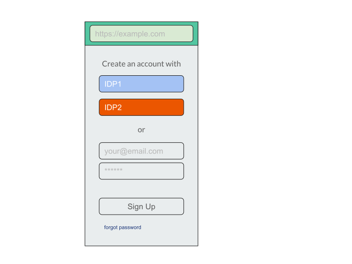
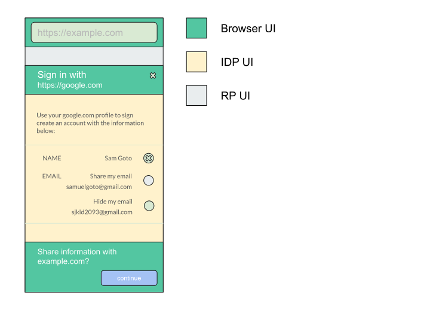

**TL;DR**; This is a strawman proposal for a new Web API that allows websites to use single sign-on federation with tighter privacy properties, namely making **third party tracking** and **identity provider tracking** substantially harder.

It is composed of (a) a **baseline proposal** that starts with a **high level API** that permits browser intermediation of existing federated sign-in flows on the web in a **backwards compatible** manner where it matters most and (b) a series of privacy enhancements are suggested as **next steps**, some requiring longer deployment windows (i.e. to be discussed separately).

# Why?

Over the last decade, identity federation has unquestionably played a central role in raising the bar for authentication on the web, in terms of ease-of-use (e.g. passwordless single sign on), security (e.g. improved resistance to phishing and credential stuffing attacks) and trustworthiness compared to its preceding common pattern: per-site usernames and passwords.

The standards that define how identity federation works today were built independently of the web platform, and their designers had to work **around** its limitations rather than extending them. Because of that, existing user authentication flows rely on general web capabilities such as top-level navigation, link decoration, window popups and cookies.

Unfortunately, these same **low-level** capabilities that facilitate cross-origin data transmission are increasingly being abused to pass identifying information about users without their knowledge or consent. Most notably, global identifiers (e.g. email addresses, usernames) can be used to **link accounts** when two or more relying parties collude.

This proposal provides a way forward for browsers to support federated identity over an explicit channel that will eliminate RP and IDP reliance on those lower level capabilities. From that baseline, the user agent will be better able to protect user privacy during authentication flows, and also the web platform can make privacy-enhancing changes without concern for breaking federated identity flows.

# Considerations

We would like to address a wide set of privacy and usability goals for identity sharing on the web, but this proposal is specifically designed and optimized for a plausible deployment strategy on the web, namely giving much consideration to **user acceptance** and **website adoption**.

A noteworthy observation of identity federation on the web today is that there are **relatively few public IDPs** in use (say, tens), particularly in comparison to the number of RPs (say, millions) and their users (say, billions). From that observation, it follows that any deployment will be much easier if it only requires adoption by IDPs and no changes or engagement on the part of RPs. Fortunately, in more cases than not, RPs implement federated identity importing a script provided by - and under the control of - IDPs, giving us a major deployment vehicle: IDP SDKs loaded into RPs. Nonetheless, while much of the client side code is under the (few) IDPs to control (e.g. we can replace redirects by other means), all of the server side code is under the (many) RPs to control, meaning that that’s harder to change. The cases where RPs implement federated identity without a dynamically loaded SDK will have a longer deployment window and will be discussed separately. 

Likewise, changing user behavior and norms is hard because of the number of people involved (say, billions). Unfamiliar login flows could result in users declining to use federated options, and instead opting for username/password credentials during RP account creation. To address that, this proposal aims to provide an experience that minimizes the divergence from existing federated identity user experience as much it possibly can (e.g. introducing new user decisions to be made).

# Prior Art

By far, the closest analogy to this work is the great work of [BrowserID](https://github.com/mozilla/id-specs/blob/prod/browserid/index.md#web-site-signin-flow) during the [Mozilla Personas](https://developer.mozilla.org/en-US/docs/Archive/Mozilla/Persona/The_navigator.id_API) effort (postmortem [here](https://wiki.mozilla.org/Identity/Persona_AAR)). In many ways, the goals that BrowserID was trying to achieve as well as the mechanisms that were created are a lot alike what’s being proposed here. There are significant differences in strategy and design, but let’s start with the similarities first because there are many.

First, BrowserID was clearly trying to solve similar problems, namely IDP Tracking and friction. The mechanisms that were created clearly had [strong builtin privacy components](https://www.youtube.com/watch?v=qHpFwdQw2wQ) to prevent IDPs from knowing about RPs and vice versa, via the chain of signatures gathered from IDPs (mainly email providers) and certificates generated by the browser.

Second, from a mechanism perspective, there was clearly a separation between an RP to Browser API as well as a Browser to IDP API. 

```javascript
navigator.id.get((assertion) => {}, {
  backgroundColor: "#606B72",
  siteName: "My Example Site"
});
```

The [RP calls a browser native API](https://github.com/mozilla/id-specs/blob/prod/browserid/index.md#web-site-signin-flow) to fetch an assertion which gets mediated by the [browser in coordination with the IDP](https://github.com/mozilla/id-specs/blob/prod/browserid/index.md#identity-provisioning-flow).

```javascript
// set up UI
navigator.id.beginAuthentication(function(email) {
  // update UI to display the email address
});
```

The postmortem analysis [here](https://wiki.mozilla.org/Identity/Persona_AAR) is very insightful in understanding what were the challenges faced and gives this proposal a solid place to work from. In many ways, we think some of these insights are rooted in the observation we made earlier about backwards compatibility with RPs and user’s current behavior, which we are deliberately trying to avoid. 

# Strawman Proposal

This strawman proposal is broken down into two parts: a baseline proposal and a series of privacy enhancing extensions.

The baseline proposal addresses the **classification problem**: turn some of the otherwise opaque data exchange that uses low level primitives (i.e. identity agnostic, e.g. redirects) into an exchange that is transparent to browsers with high level primitives (e.g. identity specific). The extensions build from that baseline tightening up the privacy properties of the data exchange.

## The Baseline Proposal

The goal of the baseline proposal is to provide a **high level**, identity specific API that allows browsers to **classify** the otherwise **opaque** transactions that are enabled by low level, general purpose APIs (e.g. redirects).

By classifying as an identity data exchange, browsers can (a) provide high level guidance to users regarding the consequences of the specific identity transaction and/or (b) demote / disencourage / prevent the opaque data exchange (e.g. opaque link decoration). 
Currently, RP sign-in flows usually begin with a login screen that provides the user options to use federated identity, as illustrated in the mock below. Today, clicking the button for an IDP usually initiates a top level navigation to a designated IDP sign-in page. 



### WebSite Sign-In Flow

In this formulation, the redirect flow gets replaced by the invocation of a new **high level** identity specific API that enables RPs to request IdTokens. While largely to be determined, a good source of inspiration and analogy can be drawn from the PaymentsRequest API (it has similar UX flows, number of players and privacy requirements):

```javascript
// This is just a possible starting point, largely TBD.
let {idToken} = await new IdentityRequest({
  provider: "https://accounts.example.com",
  // other OpenId connect parameters
}).show();
```

Here is a declarative formulation that could potentially work too:

```html
<input type=”idtoken” provider=”https://accounts.example.com”>
```

In current flows this is done on the IDP’s page following a top-level navigation, but we suggest that it could be better placed in a popup window or a tab-modal dialog resembling what is used for PaymentHandler [windows](https://www.w3.org/TR/payment-handler/#windows) or the proposed [modal-window](https://github.com/adrianhopebailie/modal-window/blob/master/explainer.md), for example combining the account selection / authentication step with the consent step, with a bottom sheet that combines IDP-supplied and browser-supplied UI to accomplish both tasks.



In this step, the browser intercepts the invocation and knows which IDP to load. The details of this step are left to the discretion of the user agent, which must decide the amount of information to provide that would sufficiently make them aware of the exchange, and also may take into account available contextual information. For example, if the user has previously signed in to the current RP with the same account, then it might be reasonable to streamline this step and presume that consent previously given still applies.

### Identity Provisioning Flow

From this point, the user selects an account with the given IDP that they want to use for federated sign-in, and authenticates to that account if they do not already have a valid session. The IDP prompts the user for consent to share the information with the RP and provides an IdToken with a newly created API:

```javascript
// This API is still largely to be determined. But here is an idea
// to get the ball rolling:
new IdentityResponse().resolve(idToken};
```

The IdToken is largely opaque to the browser in this baseline proposal, so the browser needs to gather the user consent assuming that global identifiers are being exchanged. Inspecting the data exchange and enforcing the absence of global identifiers are left as next step from this baseline. 

Finally, In possession of the IdToken and with the confidence of consent having been obtained to the user agent’s satisfaction, a data exchange can occur in accordance with OpenID Connect or SAML standards. The user agent conveys the RP’s identity request to the IDP, and an ID token is returned that is provided to the RP in order to fulfill the Promise initiated at the beginning.

# Next Steps

From the baseline proposal, a number of privacy and usability enhancements around identity management are under consideration. They each deserve to be discussed on their own merit separately, both for their technical sophistication as well as for their deployment challenges, so we’ll only cover them briefly and **we encourage you to discuss them separately on their own merits**. 

Nonetheless, here is a short summary of where we think things can go from this baseline.

## Privacy Extensions

Much of this proposal is based on the premise that we’ll achieve better privacy properties. Here are two concrete problems that we think we are going to be better positioned to tackle from this baseline.

### Third-Party Tracking

The baseline proposal isn’t sufficient to prevent third party tracking because it doesn’t get rid of global identifiers (e.g. emails, usernames). While it helps making the transaction consensual, what it does though, is to position the user agent in a place where it can mediate the data exchange and enforce policies. Much of this is still largely to be determined, but we think there will be a combination of:

- **Technical enforcement**: crypto algorithms that guarantee that the identifiers being exchanged are directed rather than global. For example, an agreed upon one-way hash function and convention on how to build directed identifiers that browsers can verify before passing back to RPs (e.g. HASH(GLOBAL_ID+ origin) == LOCAL_ID).
- **Policy enforcement**: because of the multiple ways IDPs and RPs can collude, we can imagine some attack vectors not being able to solve entirely programmatically. In those cases, because of the number of IDPs, some level of certification could mitigate some of the challenges.

Much of this is still largely to be determined and we believe it can only be looked at from the viewpoint of this baseline proposal.

### IDP Tracking

The baseline proposal isn’t changing the amount of information (nor its timing) exchanged between RPs and IDPs, especially non consensually. What it does though, is to position the user agent in a place where it intermediates interaction between RPs and IDPs, enabling it to tighten up the privacy properties of the data exchange. For example:

- the user agent could choose to prompt the user for permission early on
- the user agent could choose to delay revealing the origin of the RP to the IDP upon user consent. In this formulation, the user agent could load the IDP without telling it which RP is requesting it and only let that information be passed upon further stages of the transaction when the user understands better what’s involved.
- the user agent could step up and mint IdTokens itself on behalf of the user, using the (cryptographically signed) identity from the IDP. In this formulation, the RP could still use information from the IDP, but without the IDP ever knowing who the RP is, along the lines of the infrastructure built by BrowseID.

## Friction

The baseline proposal hopefully has a comparable or better completion rates compared to the status quo, or else IDPs will just move to other mechanisms. Nonetheless, from this viewpoint, there are a series of friction enhancements that browsers could provide, specifically around its unique ability to aggregate data across origin boundaries, for example mediating across IDPs and addressing the **NASCAR flag** problem.

# Related Work

- [Building a More Private Web](https://blog.chromium.org/2020/01/building-more-private-web-path-towards.html)
- [Personas](https://wiki.mozilla.org/Identity/Persona_AAR) and [navigator.id](https://developer.mozilla.org/en-US/docs/Archive/Mozilla/Persona/The_navigator.id_API)
- [Credential Manager](https://w3c.github.io/webappsec-credential-management/#federated)
- Add your work [here](https://github.com/samuelgoto/WebID/issues/new)
