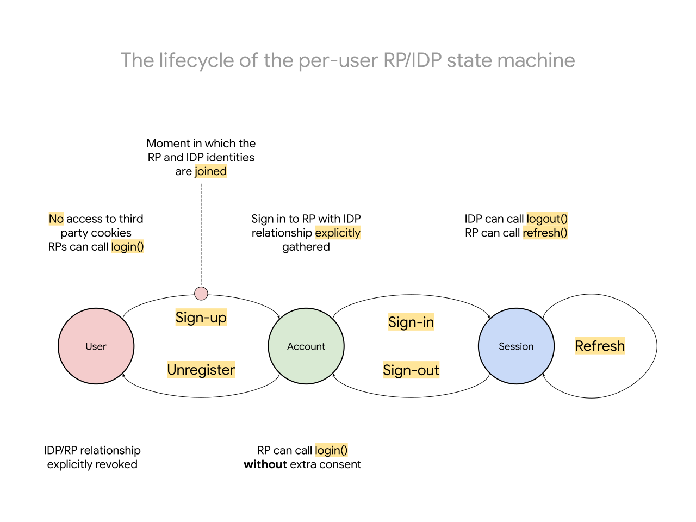
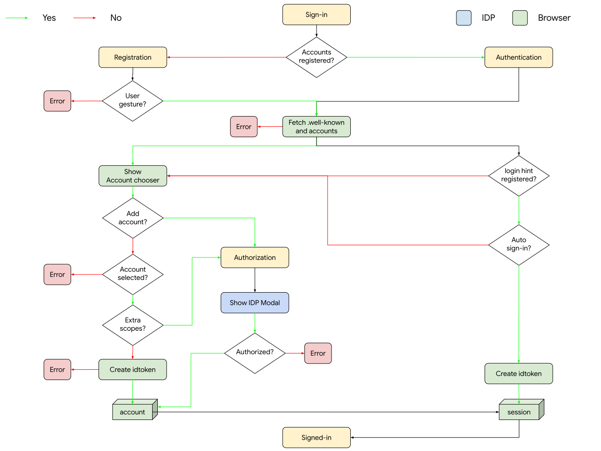
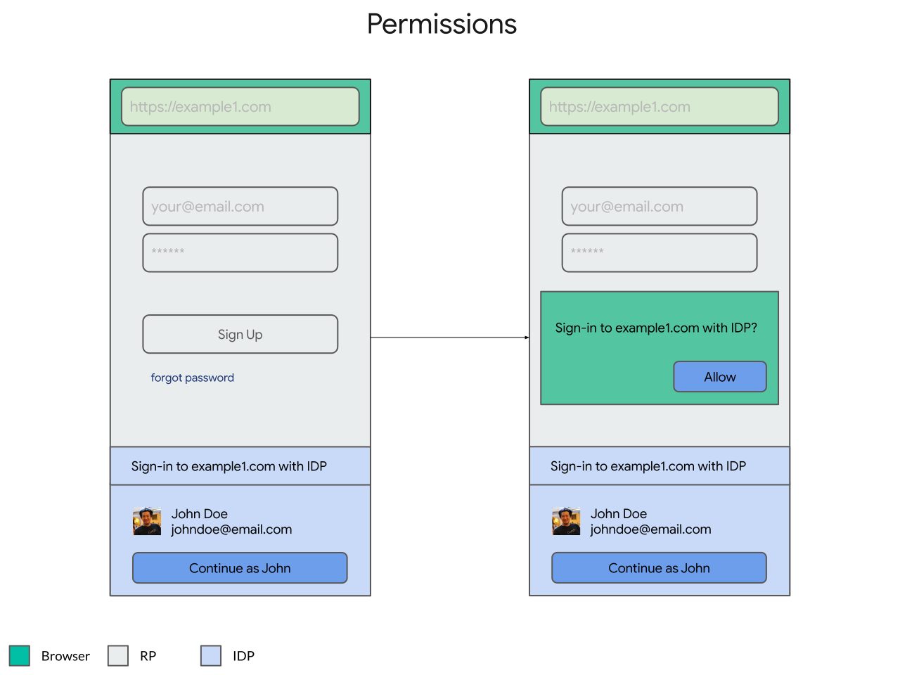

This is a **proposal** for a high level API to support identity federation under this [threat model](https://wicg.github.io/WebID/#privacy-threat-model).

It is widely known that browsers are either **already** blocking third party cookies or are planning to.

> Publicly announced browser positions on third party cookies:
>
> 1. [Safari](https://webkit.org/blog/10218/full-third-party-cookie-blocking-and-more/): third party cookies are **already** blocked by **default**
> 1. [Firefox](https://blog.mozilla.org/blog/2019/09/03/todays-firefox-blocks-third-party-tracking-cookies-and-cryptomining-by-default/): third party cookies are **already** blocked **by a blocklist**, and
> 1. [Chrome](https://blog.google/products/chrome/privacy-sustainability-and-the-importance-of-and/): on iOS **already** blocked **by default** and intends to offer **alternatives** to make them **obsolete** in the [near term](https://www.blog.google/products/chrome/building-a-more-private-web/) in other platforms.

Unfortunately, that has either broken or are about to break a few use cases in federation, namely [logging out](https://openid.net/specs/openid-connect-rpinitiated-1_0.html), social [buttons](https://developers.facebook.com/docs/facebook-login/userexperience/) and [widget](https://developers.google.com/identity/one-tap/web) personalization (anything else? add your use case [here](README.md#how-can-i-help))).

This is a proposal to preserve these operations in the absence of third party cookies.

# The lifecycle

Cross-site communication is used throughout the entire lifecycle of the user signing in to a RP with an IDP, beginning at signing-up a new user all the way through managing the sessions (e.g. signing in, signing out or renewing refresh tokens).

From a [privacy threat model](https://wicg.github.io/WebID/#privacy-threat-model) perspective, the design of this proposal is anchored on the observation that the most critical moment is the precise moment in which the identities between the RP and the IDP are joined for the very first time, namely when the user creates a new account in the RP using the identifiers from the IDP or when a user signs-in to an RP with an IDP for the first time in the browser: once the identities are joined, any arbitrary/uncontrolled cross-side communication can happen (with or without the browser's permission, e.g. via backchannel or cookie-less requests).

So, under this observation, in this proposal the browser:

1. Intermediates (e.g. gathers the user consent / intent) to observe the moment in which the identies get joined for the very first time between RPs and IDPs (a sign-up or a sign-in)
1. Stores locally the relationship between the RP/IDP that was established
1. Based on the status of that relationship (which can be explicitly revoked, e.g. via API calls or user settings), unlocks third party cookies to be sent under controlled circumstances (namelly, signing-in, signing-out and renewing refresh tokens)

The browser stores the state in which the user is at in the following state machine:



Because the first moment in which the identies are joined is the most important/critical one, we'll start there. But then, assuming that the browser was able to observe that moment, we'll go over the APIs that it unlocks to support managing sessions:

- [Account Management API](#account-management-api)
- [Session Management API](#session-management-api)

# Account Management API

The goal of the account management API is for the user agent to intermediate the creation and revocation of user accounts in relying parties provisioned by identity providers.

The account management API turns (unregistered) users into (registered) accounts (and vice-versa), which is in and on itself useful (e.g. providing basic authentication), but it also unlocks the more advanced [session management](#session-management-api) capabilities.

In its most basic formulation, the RP invokes the sign-up process via a JS API (or alternatively via the [implicit invocation](#implicit-invocation) API), namely as an extension of the [CredentialManagement API](https://w3c.github.io/webappsec-credential-management).

We propose to extend the [FederatedCredentialRequestOptions](https://w3c.github.io/webappsec-credential-management/#dictdef-federatedcredentialrequestoptions) and the [FederatedCredential](https://w3c.github.io/webappsec-credential-management/#federatedcredential) interface with the following properties:

```javascript
dictionary FederatedCredentialAuthRequestOptions {
  USVString endpoint;
  USVString client_id;
  USVString> nonce;
};

dictionary FederatedCredentialRequestOptions {
  // ...
  // TODO(goto): how do we make "provides" take the options "or"
  // the string?
  sequence<FederatedCredentialAuthRequestOptions> providers;
  // ...
};

interface FederatedCredential : Credential {
  // ...
  // New properties
  DOMString idtoken;
};
```

With these extensions to the credential management API, here is an example of an invocation:

```javascript
let {idtoken} = await navigator.credentials.get({
  providers: [{
    endpoint: "https://accounts.example.com",
    client_id: "my_client_id",
    scope: "openid email",
    nonce: "abcxyz"
  }],
});
```

## Sign-up

An (unregistered) user turns into a (registered) account via a process we call sign-up. In this process, the user agent has never observed the association between the RP and the IDP, so it intermediates the registration process.

The browser intercepts this invocation and runs the following algorithm for each RP/IDP pair:



### Fetch Well-Known

As a convention, the browser expects a `application/json` file to be hosted on the `.well-known/webid` path of the `provider` host.

The configuration file is expected to have the following format:

| Property              | Type        | Method  | Description                               |
| --------------------- | ----------- | ------- | ----------------------------------------- |
| accounts_endpoint     | URL         | GET     | Returns a list of available user accounts |
| idtoken_endpoint      | URL         | POST    | Returns a newly minted id token           |

### Fetch Accounts

The `accounts_endpoint` in the configuration that the browser gathered while fetching the [.well-known](#fetch-well-known) file is used to fetch a list of user's accounts. The fetch contains two important headers:

1. A `Sec-WebID-CSRF` which can be used by the server to know that it is an HTTP request originated from the browser 
1. The `Cookie` header which allows the server to restore the user's session

The browser expects the response to have the following format:

| Property              | Type        | Description                                          |
| --------------------- | ----------- | ---------------------------------------------------- |
| accounts              | Account[]   | The list of user accounts available                  |
| authorization_url     | URL         | A URL to redirect the user to gather extra scopes    |

Each `Account` type is an object with the following properties:

| Property     | Type        | Description                               |
| ------------ | ----------- | ----------------------------------------- |
| sub          | String      | The user's id                               |
| name         | String      | The user's full name                      |
| email        | String      | The user's email address                  |
| picture      | URL         | The user's profile picture                |

For example:

```http
GET /accounts.php HTTPS/1.1
Host: idp.example
Content-Type: application/json
Cookie: 0x23223
Sec-WebID-CSRF: random_value
```

And here is an example of a typical response:

```http
HTTP/2.0 200 OK
Content-Type: application/json
{
  "accounts": [{
    "sub": 1234, 
    "name": "Sam Goto",
    "given_name": "Sam",
    "email": "samuelgoto@gmail.com",
    "picture": "https://accounts.idp.com/profile/123",
  }]
}
```

### Show Account Chooser

With the accounts that the browser [fetched](#fetch-accounts), the browser then controls the experience with the user to carry on:


When the user selects an account, the browser does one of two things:

1. If an `authorization_url` was *not* available in the `accounts_endpoint`, an id token is immediately generated described [below](#create-idtoken).
1. If an `authorization_url` was available in the `accounts_endpoint`, the user is navigated to that URL to continue their account registration.

### Create IdToken

To create an idtoken, the browser issues a `POST` request to the previously gathered `idtoken_endpoint` while [fetching](#fetch-well-known) the `.well-known` file.

| Property     | Type        | Description                               |
| ------------ | ----------- | ----------------------------------------- |
| sub          | String      | The user id that was selected             |
| request      | Request     | The request parameters                    |

The `Request` object contains information about the relying party that is needed to mint an idtoken:

| Property     | Type        | Description                               |
| ------------ | ----------- | ----------------------------------------- |
| client_id    | String      | The relying party's client id             |
| nonce        | String      | The nonce passed from the JS call         |

The response of the `POST` request is expected to have the following layout:

| Property     | Type        | Description                               |
| ------------ | ----------- | ----------------------------------------- |
| id_token     | String      | The newly minted JWT                      |

Here is an example of the `POST` request:

```http
POST /webid/idtoken.php HTTP/1.1
Host: idp.example
Cookie: 123
Content-Type: application/json

{
  "sub": "1234",
  "request": {
    "client_id" : "my_cliend_id",
    "scope": "openid email",
    "nonce": "abcxyz"
  }
}
```

Which may respond with the following JWT:

```json
{
  "id_token" : "asdlkjop2awlasd"
}
```

And with the response, resolves the promise.

### Show IDP Modal

## Unregistering

> TODO(goto): write down how we are planning to address the revocation of accounts.
> There are three formulations here (not mutually exclusive):
>
>   - a user is able to revoke / unregister accounts in browser ui (e.g. settings page)
>   - the IDP is able to inform the browser when a revocation has happened
>   - maybe the RP gets to ask for unregistration too?

# Session Management API

## Sign-in

Signing-in is invoked precisely the same way as signing-up, with the exception of a single property:

- `login_hint`, which can be used to indicate to the browser a specific account to be used

For example:

```javascript
let {idtoken} = await navigator.credentials.get({
  providers: [{
    endpoint: "https://accounts.example.com",
    client_id: "my_client_id",
    scope: "openid email",
    nonce: "abcxyz",
    login_hint: "1234",
  }],
});
```

The same algorithm used during [sign-up](#sign-up) is used, which falls back gracefully when the internal state of the browser already contains more than one registered account.

## Sign-out

In enterprises, when users log out of IDPs, there is typically a desire for users to also be logged out of the RPs they signed into. This is typically accomplished with the IDPs loading iframes pointing to a pre-acquired endpoint for each of the relying parties ([details](https://www.identityserver.com/articles/the-challenge-of-building-saml-single-logout)).

In this proposal, the browser exposes a new JS API that takes a list of endpoints as input and:

1. makes a credentialed fetch to all of the endpoints with a corresponding session.
1. clears the session associated with the current account.

```javascript
await navigator.credentials.logout({
  endpoints: [
    "https://rp1.com",
    "https://rp2.com",
    "https://rp3.com",
    // ...
    "https://rp8.com",
    "https://rp9.com",
  ]
});
```

The logout endpoints are configured out-of-band in the process relying parties register with identity providers: the identity provider is the only entity aware of the endpoints that need to be loaded. So, an array of relying party logout endpoints is passed, and whenever the logouts have a coinciding observed login, a credentialed request is made:

> NOTE(goto): the exact criteria to make the matching between the login and logout is TBD. two thoughts occurred to us: (a) matching origins and (b) making the IDP declare the endpoint upon login.


# Alternatives under consideration

## Implicit invocation

The implicit invocation flow is largely designed to support the deployment of WebID without requiring relying parties to change. 

## Sign-up

```javascript
enum FederatedCredentialRequestOptionsMode {
  "mediated",
  "permission"
};

dictionary FederatedCredentialRequestOptions {
  FederatedCredentialRequestOptionsMode mode = "permission";
};
```

### Permissions

## Sign-in

### fenced frames

There is a variety of privacy controls that we are exploring, but the fenced frame variation is a good baseline.

In this variation, we offer the user the identity-specific controls whenever cross-site identity-specific communication is conducted (e.g. from the relying party to the IDP and vice versa), based on exposing new high level identity-specific APIs.

This is still under active exploration, but our efforts are going into exploring ways in which we can leverage [fencedframes](https://github.com/shivanigithub/fenced-frame) and introduce new high-level javascript APIs.

For example, we are looking into ways we could replace the `<iframe>` tag with the web-bundle version of `<fencedframe>`s:

```html
<fencedframe src="https://idp.example/personalized-frame.wbn" client_id="1234" scope="openid email">
</fencedframe>
```

In this formulation, the web bundle is a static (yet personalized) bundle that can be displayed on page load but can't have any uncontrolled communication outwards (e.g. over the network or over in-browser features, like postMessage).

The IDP-controlled fenced frame can communicates back with the RP with a high-level API (in replacement of the low-level `postMessage`) too (which isn't allowed in a fenced frame): 

```javascript
// This is just a possible starting point, largely TBD.
await navigator.credentials.store({
  idtoken: JWT,
});
```



Upon approval, the user agent would hand it back the result to the relying party using the existing mechanisms:

```javascript
window.addEventListener(`message`, (e) => {
  if (e.origin == "https://idp.example") {
    // ...
    e.source.postMessage("done, thanks");
  }
});
```

This variation is a great **baseline** because it is highly backwards compatible from a user experience perspective and from a deployment perspective. Relying parties don't have to redeploy, nor users will have to change their mental models about the widgets.

But this variation isn't perfect: while it is backwards compatible, we believe it leaves something be desired on **user experience**.

For one, the user has to make **two** choices (on the consequences of tracking) that are unrelated to the job to be done (sign-in) which we don't expect to be the most effective way to affect change.

That leads us to the [mediation-oriented](#the-mediation-oriented-variation) variation which bundles these prompts into a browser mediated experience (which also comes with trade-offs).


