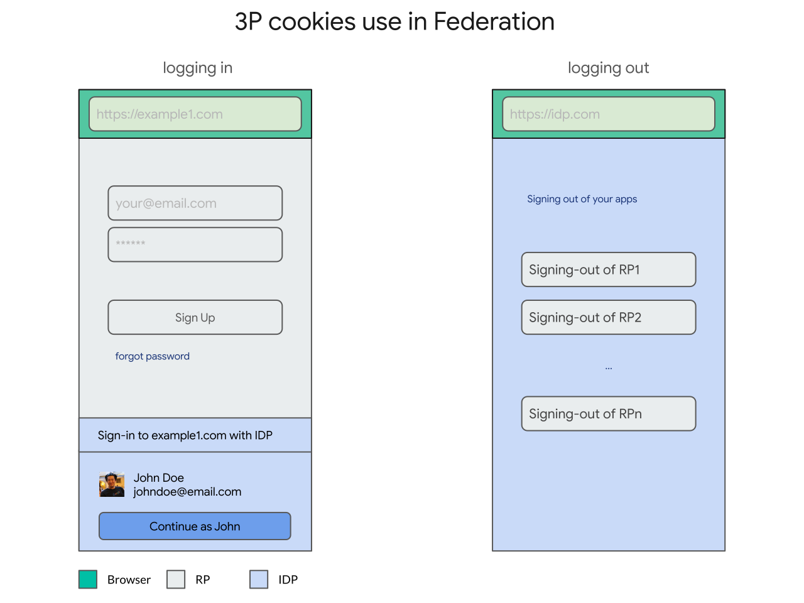
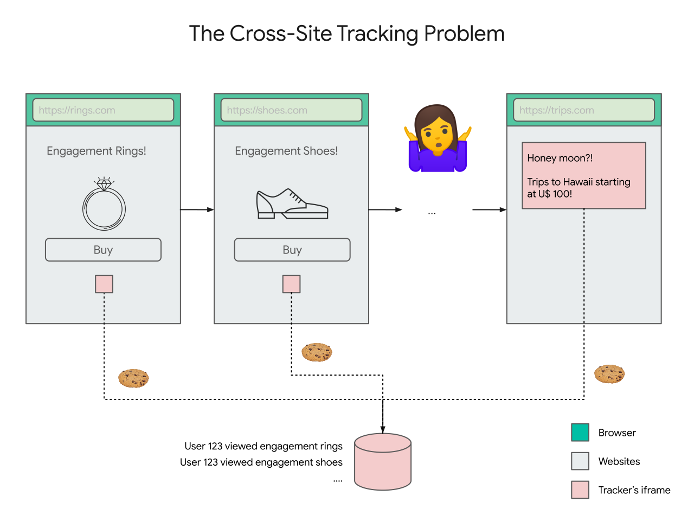
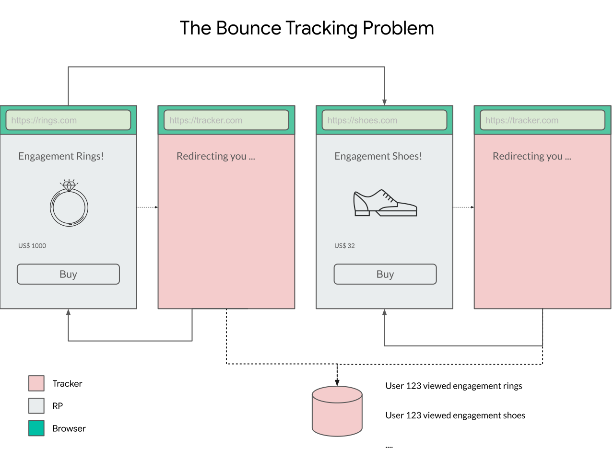

# The Problem

Over the last decade, identity federation has played a central role in raising the bar for authentication on the web, in terms of ease-of-use (e.g. passwordless single sign-on), security (e.g. improved resistance to phishing and credential stuffing attacks) and trustworthiness compared to per-site usernames and passwords.

The standards that define how identity federation works today on the Web were built independently of the Web Platform (namely, [SAML](https://en.wikipedia.org/wiki/Security_Assertion_Markup_Language), [OpenID](https://en.wikipedia.org/wiki/OpenID) and [OAuth](https://en.wikipedia.org/wiki/OAuth)), and their designers worked within the Web's limitations.

Because of those limitations, existing user authentication flows were designed on top of general-purpose web platform capabilities such as top-level navigations/redirects with parameters, window popups, iframes and cookies.

Those general purpose primitives can be used for an open-ended number of use cases (again, notably, by design), browsers have to apply policies that capture the **lowest common denominator** of abuse, at best applying cumbersome permissions (e.g. popup blockers) and at worst entirely blocking features (e.g. [blocking third-party cookies](https://webkit.org/blog/10218/full-third-party-cookie-blocking-and-more/)).

Over the years, as the low level primitives were abused, browsers intervened and federation adjusted. For example, popup blockers became common and federation adjusted to work in a world where popup blockers were widely deployed.

The challenge, now more than ever, is that some of these low level primitives are getting increasingly abused to allow users on the web to be tracked. As a result, browsers are applying stricter and stricter policies around the primitives.

> Publicly announced browser positions on third-party cookies:
>
> 1. [Safari](https://webkit.org/blog/10218/full-third-party-cookie-blocking-and-more/): third-party cookies are **already** blocked by **default**
> 1. [Firefox](https://blog.mozilla.org/blog/2019/09/03/todays-firefox-blocks-third-party-tracking-cookies-and-cryptomining-by-default/): third-party cookies are **already** blocked **by a blocklist**
> 1. [Chrome](https://blog.google/products/chrome/privacy-sustainability-and-the-importance-of-and/): on iOS **already** blocked **by default** and intends to offer **alternatives** to make them **obsolete** in the [near term](https://www.blog.google/products/chrome/building-a-more-private-web/) on other platforms.

Blocking third-party cookies broke important parts of the protocols in those browsers (e.g. [logouts](https://www.identityserver.com/articles/the-challenge-of-building-saml-single-logout)) and made some user experiences inviable (e.g. [social button](https://developers.facebook.com/docs/facebook-login/userexperience/) and [widget personalization](https://developers.google.com/identity/gsi/web)).

While it is easier to see the **current** impact of third-party cookies, it is equally important to understand the ways in which the low level primitives that identity federation depends on (e.g. redirects) are being abused and the [privacy principles](https://github.com/michaelkleber/privacy-model) browsers are using to control those primitives, so that we don't corner ourselves into another dead end.

If browsers are applying stricter policies around the low level primitives that federation depends on, and under the assumption that federation is significantly better than usernames/passwords, how do we continue to enable identity federation?

## Third-Party Cookies

The problem starts with classification.

When federation was first designed, it was designed **within** the existing capabilities of the web, rather than **changing** them. Specifically, federation worked with callbacks on top of **cookies**, **redirects**, **iframes** or **popup windows**. All fundamental primitives provided by the web which didn't require any redesign, redeployment or negotiation with browser vendors.

One example of a low level primitive that federation depends on is **iframes** and **third-party cookies**. For example, credentialed iframes are used while [logging out](https://openid.net/specs/openid-connect-rpinitiated-1_0.html), for [social buttons](https://developers.facebook.com/docs/facebook-login/userexperience/), and for [widget personalization](https://developers.google.com/identity/one-tap/web).

Unfortunately, the use of iframes is virtually indistinguishable from trackers that can track browsing history across relying parties, just by having users visit links (e.g. loading credentialed iframes on page load).

We call this **the classification problem** because it is hard for a browser to distinguish between these two cases: identity federation helping a user versus users being tracked without any control.

Third-party cookies are **already** blocked in [Safari](https://webkit.org/blog/10218/full-third-party-cookie-blocking-and-more/) and [Firefox](https://blog.mozilla.org/blog/2019/09/03/todays-firefox-blocks-third-party-tracking-cookies-and-cryptomining-by-default/) **by default** (and [Chrome](https://blog.google/products/chrome/privacy-sustainability-and-the-importance-of-and/) intends to block third-party cookies soon too) which makes these use cases inviable.

The problems then are:

1. **First** and foremost, what Web Platform features need to be exposed to (re)enable these features of federation to co-exist with the absence of third-party cookies in browsers going forward?
2. **Secondarily**, in which direction are browsers going that could potentially impact federation?

## Navigational Tracking

Before we prematurely jump into solutions for the first (and more **urgent**) problem, we think there is something more fundamental changing. Let's take a step back and a take closer look at the **second** problem: in which direction are browsers going that could more fundamentally impact federation?

While third-party cookies in iframes are used in federation, a more fundamental low level primitive that federation uses is top level navigations (e.g. redirects or form POSTs) to navigate the user to identity providers (with callbacks, e.g. `redirect_uri`) and back to relying parties with a result (e.g. an `id_token`):

However, this **low level** primitive also enables cross-site communication, namely via [decorating links](https://www.chromium.org/Home/chromium-privacy/privacy-sandbox), which can be abused to track users without their control in what's called **bounce tracking**:

In this example of **bounce tracking**, websites redirect the user to cross-origin website that automatically and invisibly redirects the user back to the caller, but passing enough information in URL parameters to enable the tracker to join that visit (e.g. when you visit rings.com) with visits to other websites (e.g. when you visit shoes.com).

In federation, that's less invisible/automatic, but it is still there. Cross-site tracking is enabled via federation when relying parties, that the user signs in to, **collude** with each other (and other entities) to deterministically (or probabilistically) **link** their user's accounts to build a richer user profile (e.g. one site selling data on browsing history for ads targeting to another service). While this could be enabled without federation (users could manually provide a joinable email address or phone number), federated identity providers have an opportunity to address this problem at scale by providing their users with site-specific/directed identifiers.

Because of these tracking risks, browsers are starting to disable third-party cookies in iframes and more generally provide tighter control over cross-site communication (e.g. a [privacy model](https://github.com/michaelkleber/privacy-model) for the web).

Because this cross-site communication takes place in a general purpose medium, it is hard for browsers to distinguish between cross-site communication that is used for exchanging identity data deliberately (e.g. federation) or unintentionally (e.g. tracking).

Browsers can't **classify** federation, hence the name.

The classification problem is notably hard because it has to deal with **adversarial impersonation**: agents who have an interest in being classified as federation to get access to browser affordances.

While the timeline for link decoration is much farther in the future, it much more fundamentally threatens federation.

> Publicly announced positions by browsers on bounce tracking:
>
> - Safari's existing deployed [strategies](https://webkit.org/blog/11338/cname-cloaking-and-bounce-tracking-defense/) and [principles](https://github.com/privacycg/proposals/issues/6)
> - Firefox's protection against [redirect tracking](https://blog.mozilla.org/security/2020/08/04/firefox-79-includes-protections-against-redirect-tracking/)
> - Chrome's stated [Privacy Model](https://github.com/michaelkleber/privacy-model) for the Web

So, how do we **distinguish** federation from tracking and elevate the level of **control** while **assuming** adversarial impersonation?

There is no one answer, we have a [proposal](proposal.md) as a starting point.
