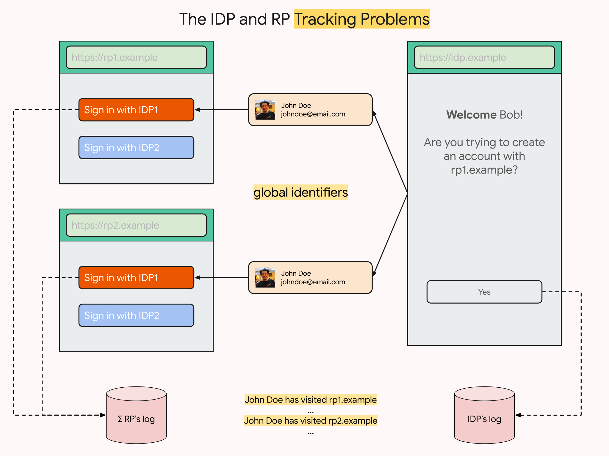
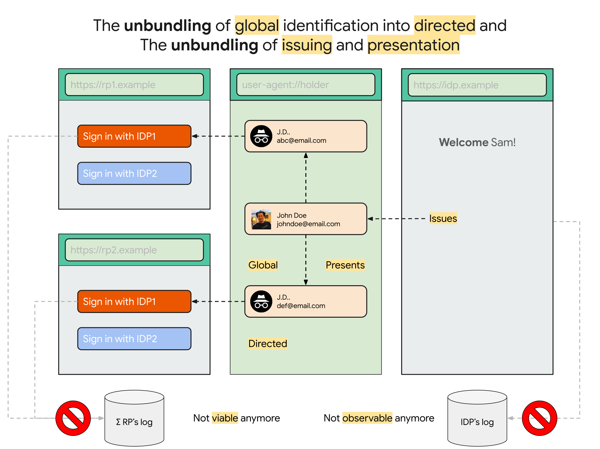
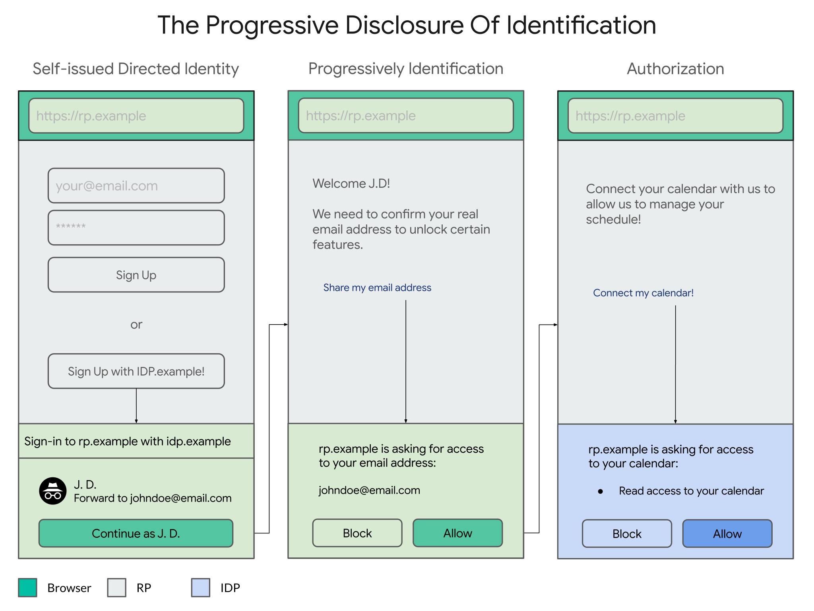
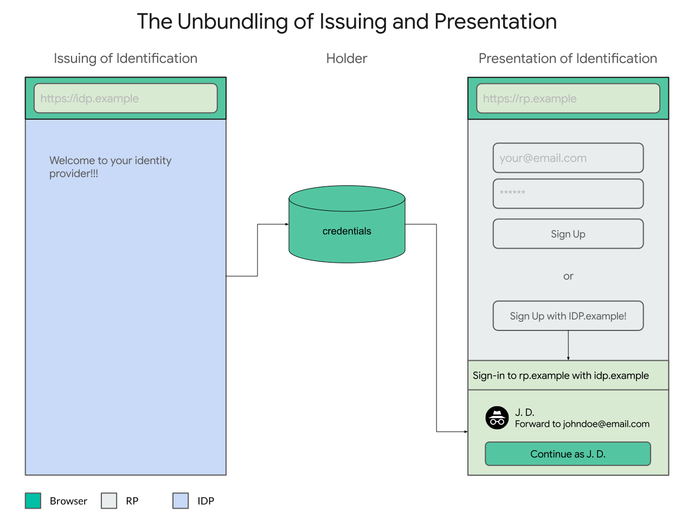
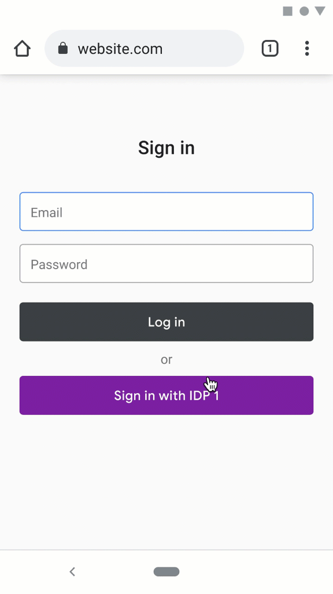

# Proposal

Clearly, this is a massive, multi-agent, multi-year problem across the board.

There aren't any easy solutions and most of the answers come in the form of alternatives with trade-offs.

There are billions of users that depend on federation on the web, millions/thousands of relying parties and thousands/hundreds of identity providers. There are also tens of browsers and operating systems, all moving independently. None of that changes overnight and we don't expect it to.

The specs that define how federation works (e.g. OpenID, SAML, etc) are intricate and long (e.g. session management, authorization, etc).

Having said that, failing to be proactive about effecting change-and making federation forward-compatible with a more private Web—can steer users to native apps or less secure patterns like usernames/passwords.

The approach we have taken so far has been a combination of two strategies:

- a **firm** and **principled** understanding of where we want to go
- a **well-informed**, **deliberate** and **pragmatic** choice of what steps to take us there

We believe a convincing path needs to have a clearly defined end state but also a plausible sequencing strategy.

1. Let's start with [where we want to be](#the-end-state), and then later
1. Go over [how we get there](#the-intermediate-states).

## The End State

We believe that identity federation on the Web needs to be supported by a foundation that is in equal parts **opinionated** and **extensible**.

We believe that identity federation on the Web needs to be **free of unintended tracking consequences**.

By that we mean:

* **The RP Tracking Problem**: Websites shouldn't be able to join your identities by default and without your control.
* **The IDP Tracking Problem**: Identity Providers shouldn't be able to be involved without justification by default and without your control.



In the future, we'll have two fundamentally different things: consequence-free defaults and control. Identity federation on a Web that is narrowly private by default and broadly identifying by choice.

> We don't believe these to be much different from the properties that Kim Cameron identified in the [7 laws of identity](https://www.identityblog.com/stories/2005/05/13/TheLawsOfIdentity.pdf), namely the "User Control and Consent", "Minimal Disclosure for a Constrained Use", "Justifiable Parties" and the "Directed Identity" laws.

The principle used as a foundation to effect change on the defaults and controls is that cross-origin communication is a privileged operation and needs to be intermediated by the user agent.

> When there is a conflict of interests for the parties involved, we think the following is the right order of constituencies: [users first](https://www.w3.org/TR/html-design-principles/#priority-of-constituencies), developers second (relying parties and identity providers, in that order), browser engines third, and technical purity fourth.

In the future, the user agent will intermediate and assist in the cross-origin exchange of identification by picking better defaults in two ways:

1. **The RP Tracking Mitigation**: Unbundling your **global** identity into multiple **directed** identities per-site.
1. **The IDP Tracking Mitigation**: Unbundling the **issuing** of credentials with their **presentation**.



The first principle can be solved by the user agent insisting on a progressive disclosure of identification, starting with the minimal disclosure for the most constrained use (e.g. a directed identifier that is recoverable between devices) towards progressively and contextually exposing information (e.g. giving access to your calendar):



The second principle (unbundling the issuer from the holder of credentials) is more technically involved, but has a real world analog: driver's licenses.

When you present your driver's license as a form of identification to, say, a store that needs to check your age, the government issuer of the driver's license isn't involved (and its involvement doesn't seem to be justified). The **presentation** of your driver's license is decoupled from the **issuing** of your driver's license.

We believe that unbundling these operations, means users can use their credentials without **necessarily** phone-homing to their issuers:




### The Delegation-oriented API

So far, none of these are original ideas. Proxying email addresses and directing identifiers is a norm for some identity providers and self-issuing credentials has been proposed by [BrowserID](prior.md) for example.

However, while these ideas exist in isolation, a system that combines them is hard.

We call the active investigation of a protocol that can solve both of these problems (as well as recovery) the **Delegation-oriented Model**. Without much explanation (full details [here](https://docs.google.com/document/d/1ZymcC2ABSzwJloXje5R_KFLi0-Vaz03iLR9DjwQl9u0/edit)), here is a glimpse of what that may look like:


The Delegation-oriented Model is very compelling as an end-state for FedCM because it solves both tracking problems. Because it solves both tracking issues, it doesn't have any unintended tracking consequence.

Because it is **consequence-free**, we expect it to be **permission-less** (the best permission is the one that isn't needed) and comparably better for users with formulations that impose on the user to make a determination on the consequences of being tracked.

The Delegation-oriented Model isn't free of challenges though. Its weakest point is that it is (a) not backwards compatible with the current deployment of federation on the Web and (b) not perfectly clear if the incentives are well aligned to establish an economic equilibrium.

While not all of the pieces are put together, we think the Delegation-oriented model represents the northstar that we aspire to.

These problems, as well as others, are being explored more in-depth [here](https://docs.google.com/document/d/1ZymcC2ABSzwJloXje5R_KFLi0-Vaz03iLR9DjwQl9u0/edit).


## The Intermediate States

There are a large number of mid-game states between the opening and the endgame for FedCM.

It is unclear how many of these are sustainable/desirable long-term, and how they will evolve, but their existence for a non-trivial amount of time is non-neglectable.

For the most part, these states are a trade-off between backwards compatibility (for users, relying parties and identity providers, in that order) and effective controls (ignorable permission prompts, mediation, and removing the tracking risks altogether, in that order).

Our best guess at the moment is that each of these three variations (delegation, mediation and permission) have different trade-offs that don't put them at mutually exclusive positions, meaning we could imagine a state where all of these three variations co-exist.

So, having said that, let's start from most backwards compatible to least.

* [The Permission-oriented API](#the-permission-oriented-api)
* [The Mediated-oriented API](#the-mediated-oriented-api)


### The Permission-oriented API

It is clearly highly desirable to minimize deployment costs: the less asked of developers (while keeping/raising the privacy bar), the better.

That's what the HTTP API is all about: backwards compatibility.

We're still exploring this space, trying to understand if it's possible to classify federation with zero changes in the ecosystem.

Because a significant part of federation is deployed over well-established protocols (e.g. OpenID, SAML), their HTTP profile is somewhat easy to spot. For example, for OpenID Connect requests/responses the HTTP requests have:

- a **client_id** parameter
- a **redirect_uri** parameter
- a **scope** parameter
- an accompanying **.well-known/openid-configuration** configuration

In this formulation, a user agent could intercept HTTP requests made in this fashion and provide permission prompts to gather the user's intent to sign in and hence, for example, allow the request to be made credentialed with cookies:



The way back from the IDP to the RP is also highly structured, so responses can be classified (and made credentialed) when they match:

- a redirect to the previously used **redirect_uri**
- an **id_token** parameter

Notably, for cases where the IDP controls the deployment of the JavaScript running on the RP page (typically opening a popup window), we are also exploring offering a more explicit API, such as:

```javascript
// This is just a possible starting point, largely TBD.
//
// Note, this historical, see https://w3c-fedid.github.io/FedCM for the current API.
//
let {idToken} = await navigator.credentials.get({
  provider: 'https://accounts.example.com',
  'ux_mode': 'permission',
  // other OpenId connect parameters
});
```

So, to sum up:

* **Pros**: most backward-compatible.
* **Cons**: permissions aren't expected to be the most effective way to offer privacy controls.


### The Mediated-oriented API

Another potential step, somewhere in the middle of backwards compatibility and privacy control, is what we've been calling the Mediated-oriented API.

In this formulation, the triggering of the API works similarly as before, but the execution is done in an intermediated fashion:

```javascript
// This is just a possible starting point, largely TBD.
//
// Note, this historical, see https://w3c-fedid.github.io/FedCM for the current API.
//
let {idToken} = await navigator.credentials.get({
  provider: 'https://accounts.example.com',
  'ux_mode': 'mediation',
  // other OpenId connect parameters
});
```

This is accomplished via an HTTP protocol between the IDP and the User-Agent ([under exploration](HOWTO.md#identity-provider-implementation)):


The mediated-oriented API offers a balance between trade-offs:

* **Pros**: backwards compatible with relying parties (which are many), requires work from the IDP (which are few). Largely backwards compatible from a user experience/behavior/norm perspective. Privacy controls are offered contextually.
* **Cons**: takes on some of the responsibility for the user agent (e.g. account chooser), which affects the autonomy of IDPs and RPs.
