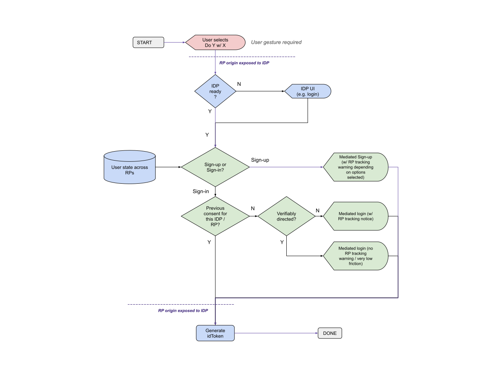

In this variation of the Provider API, we modify the Permission-oriented variation to:

- minimizes the number of consent moments in the “happy path” case where the IDP is only sharing a directed profileinformation. 
- Bundle the prompts to unify the case where the users opt into using an undirected profile. 
Allow the user agent to pick defaults (e.g opt-out vs opt-in) regarding the promotion of directed identifiers.

The fundamental modification to achieve these goals is moving from a UI that is controlled by the IDP into UI flows that are mediated natively by the browser.  

In this formulation, we solve the cross-browser consistency by leveraging the IDP: specifically, the IDP tells the browser whether a given flow is a sign-up or sign-in. A consequence of this is that the IDP must learn at least the RP’s origin before the browser UI is painted. This flow is similar to [Permission-oriented API](permission_oriented_api.md) in that it makes the assumption that IDPs can learn the RP's origin after a user gesture on the RP page.

# Challenges

- Browsers need to become opinionated about sign-in and the subset of flows that enables it.
- User comprehension challenges: the browser UI is displaying data (including T&Cs) provided by the IDP. Will users get confused and take it as browser provided data or that the browser has fully vetted the IDP?
