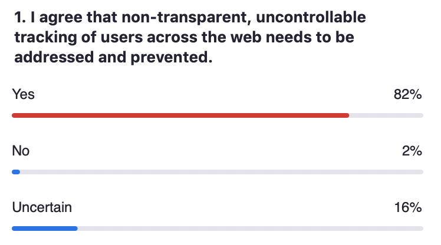
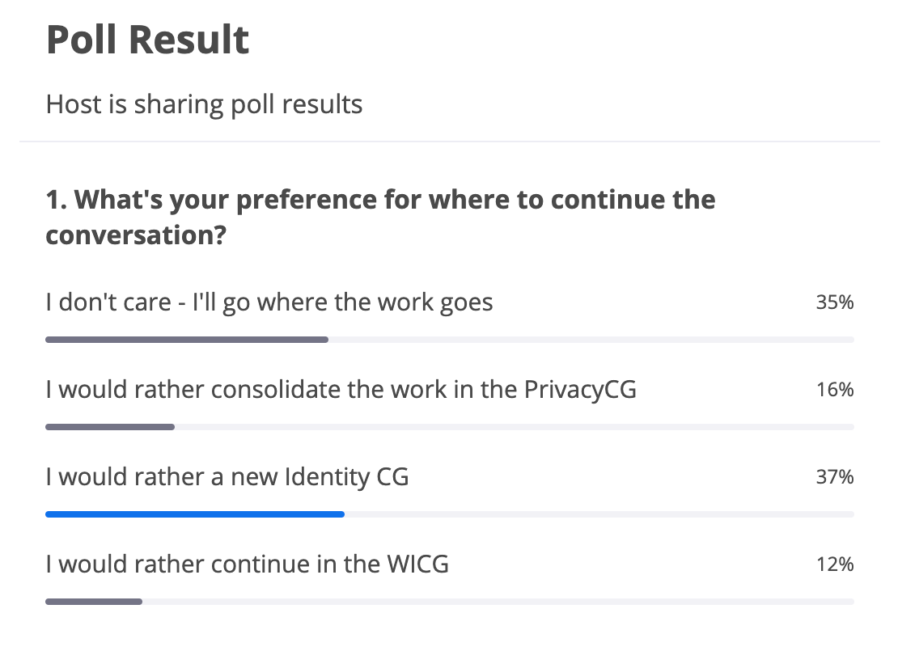
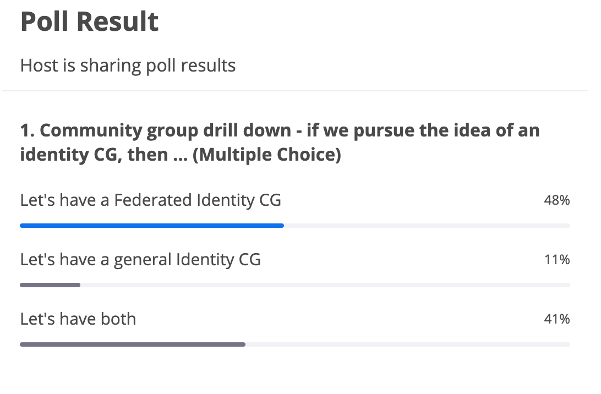

Chair: Heather Flanagan

Scribes: Max Duval, Majid Valipour, Lee Graber

**Participation is limited to W3C WICG members ([<u>joining is
free</u>](https://www.w3.org/community/wicg)) and will be governed under
the W3C [<u>Community Contributor’s
Agreement</u>](https://www.w3.org/community/about/process/cla/).**

**To join the W3C Community Slack instance (\#federation channel):**
[<u>https://join.slack.com/t/w3ccommunity/shared\_invite/zt-drq1eer6-MlZgOJOWVAEV1UTp66ywAQ</u>](https://join.slack.com/t/w3ccommunity/shared_invite/zt-drq1eer6-MlZgOJOWVAEV1UTp66ywAQ)

Notes from Day One
------------------

[<u>https://docs.google.com/document/d/16wj6UnlaePCE0sdVfkVSwoBMHuFphLuv2sptxdQgayE/edit</u>](https://docs.google.com/document/d/16wj6UnlaePCE0sdVfkVSwoBMHuFphLuv2sptxdQgayE/edit)

Administrivia
-------------

*Managing the discussion will need to be strict - raise hands, use the
queue, and be prepared to be kept to time. We’re hoping this is just the
beginning of a series of conversations.*

Agenda - Day Two
----------------

-   Recap of Day One and Intro to Day Two (10:00 - 10:10)

-   Discussion

    -   What Problem are We Trying to Solve? (10:10 - 10:40)

    -   User Provisioning in a Mediated World (10:40 - 11:00)

    -   AuthN vs AuthZ (11:00 - 11:15)

    -   Browsers as Adtech Companies (11:15 – 11:20)

    -   Legal Considerations (11:20 – 11:30)

-   BREAK (11:30 - 11:45)

-   Continuing the Conversation(s)

    -   Documenting Scenarios (11:45 – 12:00)

    -   When, Where, Who? (12:00 – 12:45)

-   Wrap Up (12-45 – 12:55)

Notes - Day Two
---------------

(Heather) -- Day 1 -- solid steps to increased awareness. Not clear how
we are going to move forward (agreement on how to do this)

Agenda -- (see slide link)

What problems are we (trying to) solving

-   Important to note that open to discussing solutions. Not married to proprosals

-   \[Slide\] problem statement + anonymous poll

    -   “Non-transparent, uncontrollable tracking of users across the
        > web needs to be addressed and prevented.”

    -   Federated login and tracking tools use same primitives

Brad Hill: At the limit, this is a version of the confinement problem, how to prevent data from escaping its bounds. Preventing all communication between different origins on the web is a very extreme position. Federated identity is the thing in the path of the anti-tracking bulldozers with the most visibility and clear constituency. If we move it out of the way by making it legible to and
intermediated by browsers, that clears the way for many other use cases to be bulldozed that are important but may not have voices with the same
volume and unity as identity. The goal of blocking tracking needs to be balanced against the costs to other things, and maybe technical enforcement in browsers reaches a limit in those tradeoffs where other approaches are needed for the long tail.

Wendall Baker: TLDR In order to sell media, you need to measure it. In the past, they did panel studies, audited circulations. In the development of the internet we added tracking, which keeps good records.
There is unauthenticated tracking, were adv. should not see it. There also is ???

Brian Campbell: The actual details of what constitutes non-transparent/private are pretty fuzzy, and not agreed on by all constituents here. The sort of things that need to be protected is unclear. In more concrete terms: embedded 3p tracking that users have no information about, is going to have a lot of pushback. This seems very clear, users don’t want/know about them. Federated login is murkier, and the fact that it resembles bounce tracking is something that users will pick up on. (?)

Mark Lee: Unsure about the question. Concern around being extremely clear on what we’re trying to do. Worry that this will prevent innovation, as if the behaviours are completely prevented by browsers, this cannot be explored.

Aram Zucker-Scharff: Back-and-forth is probably due to unconsented, untracked. Unsecured web is something we “all” don’t want. There is the legitimate need to track users across the web. There is a crossover. Is federated login and fed identity is the appropriate way of tracking
users. Project UID2 / Rearc. Others (including me, Aram) will say identity is not the way we should track users on the web. Cross-site tracking has led to lack of trust. There seems to be interest in people to resist / opt-out due, which would make identity the wrong tool for tracking users.

Tess: The first bullet is a settled question in the web standards community.
[<u>RFC-7258</u>](https://datatracker.ietf.org/doc/html/rfc7258)
Establishes the relevant frame, also TAG finding on [<u>unsanctioned
tracking</u>](https://www.w3.org/2001/tag/doc/unsanctioned-tracking/).
It’s a great thing to bring more stakeholders. I see little value in questioning the first bullet point. I don’t think it’s an option to choose to accept how the web has operated in last 20 years. Major browsers are also unlikely to let this happen.

[<u>https://datatracker.ietf.org/doc/html/rfc7258</u>](https://datatracker.ietf.org/doc/html/rfc7258)

[<u>https://www.w3.org/2001/tag/doc/unsanctioned-tracking/</u>](https://www.w3.org/2001/tag/doc/unsanctioned-tracking/)

Kai Lehmann: GDPR in Europe means you need user consent in order to save data about them. This does not exist elsewhere in the world. Can we find a technical solution, rather than having to rely on the legal way (?).

Peter Saint-Andre: It’s taken 20 years to get to this point, and pervasive surveillance is screwed up. It will take a while to fix. Beginning of conversation. Identity is a huge topic with implications for things like payments on the web, and people have worked on an identity layer for a long time. It’s better to focus on the second point. There’s more than ads and tracking, and it would be more fruitful to focus on identity to find some good solutions.

–

### User provisioning in a mediated world

**Sam Goto**

-   Sam: There will be a spectrum of options as we work this through. A spectrum. We’ve only come up with 3 complementary options so far.

-   Sam: We think doing mediation only for a small subset of OAuth permissions. Try to keep most of the decisions in userland.

-   **Brock Allen:** many journeys may not be possible with yesterday’s demonstration

    -   A chained IdP workflow

    -   User needs to register with IdP

    -   Workflow leading to MFA

    -   If the browser takes over and only allows users to log-in via its internal API, this would not work in the above scenarios

-   Sam: Recommend to go back to the slides and choose the *permissions* model, rather than *mediation*

-   **Kai L**: … \*describes workflow with two permission prompts required\*

-   Sam: Two permissions prompts would not be ideal.

-   **Hirsch Singhal**: Are you saying you’ll pick 1 of these three, and that’s what the web will look like? Or will all three coexist?

-   Sam: I believe that they are not mutually exclusive. Some might not be viable. The final set will be a superset of the three that we are exploring so far.

-   **Achim:** Fenced frame might be a type of permission, redirects would be a different kind of permissions, and maybe a third kind of permissions. Need clarification on what the main kinds of permissions are.

-   Sam: These options were found by looking at the current ecosystem. Asked what were the things that needed to be unblocked, or made possible. Some things have already been made impossible by browsers. Iframe and 3P are absolutely going away. [<u>Fenced frames</u>](https://github.com/shivanigithub/fenced-frame) may help to provide personalization, as you could have FedCM inside and it could talk outside of the fenced frame.

-   **Peter Saint-Andre:** the point of browsers is that it helps people (not users) understand what is happening under the hood. There are different kinds of users, entreprises. We’re protocol designers here, but need to understand that there is a responsibility for browsers to understand what actual users/people want.

-   **Heather:** I agree that we’re not necessarily the best to evaluate
    > what users might want.

### 

### AuthN v AuthZ (authentication, authorization)

-   **Sam Goto:** This is specific to 2nd and 3rd implementations. If you call the API and you’ve already logged in, this would open a prompt similar to payment handler UI (i.e., IDP UI is shown).

-   **George Fletcher:** If you really separate these two things, there’s interesting nuances that we need to think about.

    -   1\) IdP initiated login.

    -   2\) Cases where separating them creates requirements on each other.

    -   3\) How does the flow work when the app needs action that is not directly related to the login

-   **Vittorio Bertocci:** We use these terms as scientists. In my experience, people understand all of this as “things that need to happen before I can do something”. All these details are not things that a lot of users think very much about. It’s not the highest order bit to create this distinction/division, which probably does not live in the prospective developer and users. Analogy: Javascript is very loose, which is why it’s widely adopted, too strict prevents adoption.

### Browsers vs Ad Tech companies

**Heather Flanagan:** Do not want to repeat the clash we had yesterday in response to prepared FB comment. Ad tech exists and relies on tracking; pursuing that thread here will just increase divisive conversation. While we do need to recognize there is a perception of conflict of interest in having the browser vendors who are also adnetwork vendors handling tracking limits.

### Legal Consideration

**Heather Flanagan**: GDPR was mentioned yesterday and there are other related legislation in other states. Are there any lawyers that can speak to this? Or anyone with perspective.

**Hirsch S:** Parental consent, age requirements (Korea, ..?). There is a long list of requirements that we need to achieve during authentication before they can access the service. The RP building against the MS platform can ask or certain requirements, such as whether a user is above a certain age (without precise age given). RP’s prefer to not record that information in their system so rely on MS Platform to handle that.

**Wendy Seltzer**: If people extract needs and requirements from legal rules and regulations, that’s more helpful in this venue than legal argument.

**Tess O’Connor:** to mention the Centralized Consent API proposal:
[<u>https://github.com/WebKit/explainers/tree/main/CentralizedConsentAPI</u>](https://github.com/WebKit/explainers/tree/main/CentralizedConsentAPI)
There are use cases and requirements that fall straightforrwardly
outside of GDPR. This is an area of active work. There are clear use
cases for limited client-side storage which enable this. Getting more
information about the context of these uses-cases, this is useful and it
needs to be solved.

**Kai Lehmann:** The consent is not an issue with Permission oriented. But how does it work for the mediated API, which I think is the holy grail here, where the IdP and RP don’t talk to each other.

**Sam Goto:** Mediation and Delegation have this issue that we need to solve. Delegation is even further away.

**Heather Flanagan:** There’s a lot of what-ifs, but not much actual implementation. One of the more active ways to engage is to become part of the testing. Engaging with proposals and seeing where these APIs break is going to be very beneficial.

**Vittorio B:** We have to be aware of the PR issue/worry. There are asteroids coming towards us, (3P cookie, etc. ) . Understanding what is going, when, and what is more speculative is important. What is experimental and what is the actual direction of travel.

**Heather F:** there’s two sides to this, and as a vendor you really want to know exactly what and when things will happen.

**Sam Goto:** We’re actually writing code and engaging, including early prototypes in Chrome Canary. You can flip flags in Chrome and tell us what works and what doesn't. We spend 80%-90% working the two variations: *permission* and *mediation*. We also develop *delegation* as a North Star, which helps us design with the ideal in mind, even if we don’t end up there. It solves most privacy problems but creates others. There are lots of things to be explored in *delegation*
variation including incentives, etc.

**Vittori B:** For the “masses”, understanding what Chrome is working on is important. Separating short-time experimentation from the long-term plan. Customers want to make sure that they can have business continuity.

**Lee Graber:** There is a distinction between things that are
statements: Third-party cookies are going away. The solutions to
actually prevent this breaking is more in the realm of years. How are we
sure things don’t all fall down once we flip the switch. We need more
than one month with a clear alternative before the end of 3P cookies.

**Sam Goto:** I will try to ping Kaustubha Govind who can speak more
accurately at a high level about Chrome’s privacy sandbox.

**George Fletcher:** What does that mean for nested iframes, what about
Same-site=None / Same-site=Lax. What does that mean when 3P cookies are
going away? Are cookies just never sent? We’ve seen changes in how Lax
has changed with redirects. I want to set this in really concrete terms.

**Achim Schlosser:** There is now in the explainer some more text on the
stages for the proposals but it is deeply linked. Better to make it more
prominent. Also other proposals in Privacy CG (?) that need to go in
production before 3P cookies are removed.

**Heather F:** Would the Privacy Sandbox team be able to make a blog
post answering these questions, and plan around timeframes.

### BREAK

Heather F: Kaustubha is here to give updates on Privacy Sandbox.

Kaustubha G: There was a question on timing on 3P cookie removal. I am
the only representative from Privacy Sandbox. Not able to share a
timeline but we are committed to do this transparently and thoughtfully.
The timeline is aggressive but we are committed to giving the ecosystem
meaningful notice. This includes sharing proposals and working with the
ecosystem. I understand this does not give a timeline but hopefully help
reduce anxiety on this.

### Continuing the Conversation

**Vittorio**: Sharing what is being done in OpenID Foundation to
document usecases. We have been collaborating with the FedCM project on
this. Discovered we have to go over the same points multiple times.
There was a need to share information better. Discussion on IETF to
create a catalogue of the current practices around Identity flows using
web primitives. There is a repository and a template
([<u>https://github.com/IDBrowserUseCases/docs</u>](https://github.com/IDBrowserUseCases/docs)).
The template describes the reality as it is today

-   What protocol

-   Which browser features

-   Target audience of this feature

-   How popular is the feature?

This can help figure out if there is a change in browser feature, who
and how is impacted. Example of “Simple redirects sign-in with 1RP -
OIDC code flow)

Another example is the work that is done by Achim, especially
interesting is the documentation of which IDPs are using this flow.

It will be fantastic for Identity people here to add their scenarios.
This is not a standard. This is hopefully a useful reference for
browsers.

**Sam G:** We appreciate and support this work. Extremely helpful. Also
useful that changes charged discussion into concrete use cases. This is
useful for Chrome but I suspect other browsers as well.

### When, Where, Who?

**Heather F:** Last week PrivacyCG call touched on some aspects, similarly Open ID foundation, Also ??. But this is not the full picture that we have been discussing here? Poll:

**Tess O:** I have 3 things to point out. The slack thread suggests
people are interested in “I don’t care” option.

With my PrivacyCG chair hat on there are aspects of this that we are
interested to have there. Also pointing out that while we like to use
law to inform usecases but that is a technical forum. Finally, I suggest
have the work where the people are. I will happily provide feedback
where the work is. I am interested about the FedCM folk’s experience in
how WICG has been? Getting feedback from wide enough audience? Positive
or negative.

**Tim C:** Few of us on Identity side are aligned on Identity CG in W3C.
There is confusion about FedCM? Is this a Google project? Not having a
name on the project and a longer vision is good. There are a few of us
that have this opinion.

**Sam G:** I agree with Tess on going where the work is. Having a place
where everyone feels included and part of the discussion. So far we are
not having a hard time with WICG. I wanted to make sure there is no
single major thing controlling the agenda (Chrome, Privacy, Identity).
Having a neutral forum where tensions are presented is good but wanted
to make sure the work gets done. Having it be a Chrome only initiative
is not our goal and does not achieve our intentions. Asking browser
engines, Identity provider, since they are doing the work and we want to
make sure they are engaged.

**Vittorio:** I back the creation of Identity community group. In past
few month experience, Difficult to gather interest in Identity
community, mostly a bystander problem. PrivacyCG was a good experience.
Challenge there is that their highest order bits is privacy and some of
the folks here don’t have that. I believe because of this if we host in
PrivacyCG would exclude identity community. So having a separate home is
a net benefit.

**Melanie R:** Most important is to have the community under
consistent/regular structure. Lots of communities have this. The current
Ad-hoc structure is not viable. Agree that is may be natural to have a
separate forum under W3C for identity but PrivacyCG is good.

**James Hartig:** Concern about scheduling if there is a separate group.
Also concerned with visibility if there are related proposals.

**Tess O:** (changes hat) We are happy to stay in WICG, if it moves in
Privacy CG we are fine. If we create a new CG we can help set it up. We
consider WICG as a last resort since there is not much structure. Other
CG have more hands on chairing and do not rely only on editors. What
kind of support does FedCM folk need? James point on \# of groups is a
fair one.

**Sam G:** I want to take note of isLoggedIn and that there is lots of
intersections. It will be constructive to have some of the same
conversations with the same people.

**George F:** I am (not?) in favor of a new group given the scheduling
issue. Privacy CG may have the right people and we can add others. But
I'm concerned that there may be too many topics there. So a separate
group could avoid stealing time on

\[Another Poll\]

**Tess O:** CG in W3C are created by members and there is no need to ask
W3C to create it.

**Tim C:** Based on this We (microsoft) are happy to help start a
community group.

**John W:** Webkit/Apple. On the question of IsLoggedIn. We are
interested in integration with FedCM (issue filed).

-   IsLoggedIn is more a lightweight thing for Website to indicate login state

-   FedCM is more specific on formulating the login

-   IsLoggedIn could be merged with FedCM, and the discussion should continue

**Sam G:** I voted we will go where work is. My biggest concern with
Identity CG is for it to be too broad. I am specifically concerned about
pushing DIDs, verifiably credential etc. I want to avoid having that
pull back the sense of urgency from privacy changes.

Perhaps a federated Identity Working Group is more specific.

**Brian May:** If a meeting is not focused on a specific problem then it
does not give it justice. So in favor of a specific community group.

**Wendell Baker**: There are already w3c groups around identity. Also
sympathetic to have a focused group. Suggest sub-committee as a possible
solution. Also may be helpful to have cross-group discussions
(education, enterprise) e.g., ad groups are building identity solutions
so hopefully yourwork helps address (prevent?) that.

**Tim C:** Putting naming aside for now. But if we changed the focus (to
not include DIDs) we will withdraw support for creating a new CG. Like
it or not decentralized identity is happening and does need to be part
of the conversation. Specially if we want to discuss creating APIs in
the browsers.

**Dick H:** My proposal is to call it Federated Identity working group
based on existing protocols (SAML, OAuth, OIDC, …). I worry that talking
about everything about identity is not focused enough. There are venues
already on other items. Conversations are best focused on the impact of
browser privacy related changes on existing work.

**Vittorio:** The goal is to make an impact on the world Today! Today
there’s not a single app on my phone that is using this protocol.
Federated Identity CG might not be future-proof, but anchored in the
reality of now, and focussed on actual, pressing problems.

**Heather F:** Suggests having a poll.

**Tim C:** Suggest changing the poll to have option for a larger
identity group with subgroups (Federated identity, DID)

**Heather F:** I don’t want the sub-group to be bigger than the
subgroup. Both implies subgroups.

\[Poll is changed to include “both” option referencing Tim’s
suggestion\]

**Heather F:** I personally think that the options are not mutually
exclusive. Do community groups have charters?

**Tess O:** They operate under [<u>W3C CG and BG
process</u>](https://www.w3.org/community/about/process/). They are not
required to have a Charter but they normally do. It could be simple or
elaborate. There is a template that W3C has for these that you can use:
&lt;[<u>https://github.com/w3c/cg-charter</u>](https://github.com/w3c/cg-charter)&gt;.
If you don’t think this is a unique CG with particular needs then just
start with the cg-charter template and substitute in the group name etc.

**George F:** To me it feels easier to have one CG and focus it. In
particular permission/mediation is more focused on current practices.
But delegated oriented which Sam calls a far out variation seems to have
lots of overlap with DID *(Decentralised ID)* etc. But I agree that our
focus should be on the changes in browsers that are happening now.

**Tim C:** Oftentimes DID is bundled with SSI. For example, using DID as
an identity format is not related to SSI. The term DID is diluted and
freaks people out but the underlying tech can be applicable.

**Vittorio**: Just mentioning DID now when we are talking about missing
and group ???. DID (for some people) is a pointer to lots of complexity
and that is a sign we should remain focused.

**Heather F:** I don’t have a list of contacts for people to reach out
to. We want to kick off CG organizing. My idea is to start a plan for a
CG charter for federated identity that will later be a sub-committee of
a future larger Identity group with broader focus. Any objection to
this.

**Heather F:** If you are interested in drafting a charter please drop a
note in the slack. I think there is enough consensus on ongoing
meetings.

\[poll: on the first potential topic for the future Federated Identity
CG\]

Other possible topics from Slack:

-   David Waiter: I’d love to get more details on what actually is planned in terms of additional bounce tracking preventions

-   Mark Lee: Are we looking to be backwards compatible with everything or are we accepting that things will break and deciding what is acceptable and whether we should do that?

-   Sam Goto: My "other" option noted in the last poll is: "lets talk about what needs to happen in the absence of third party cookies"

-   Brad Hill: My other: RP use cases, utility functions, legal requirements, etc.

 

Attendees (sign yourself in, alphabetical order please): 
--------------------------------------------------------

1.  Aaron Parecki (Okta)

2.  Achim Schlosser (European netID Foundation)

3.  Aram Zucker-Scharff (he/him; The Washington Post)

4.  Bill Densmore (ITEGA.org)

5.  Brad Hill (he/him; Facebook)

6.  Brendan Riordan-Butterworth (IAB Tech Lab / eyeo GmbH)

7.  Brian Campbell (Ping)

8.  Brian May (dstillery)

9.  Brock Allen (Duende Software)

10. Chris Needham (BBC)

11. David Waite (Ping Identity)

12. Dick Hardt (Hellō)

13. Elaine Knight (Apple)

14. Filip Skokan (Auth0)

15. Filip Verley (Google)

16. George Fletcher (Verizon Media)

17. Guibin Kong (Google Identity)

18. Heather Flanagan (Spherical Cow Consulting)

19. Hirsch Singhal (Microsoft Identity)

20. James Hartig (Admiral)

21. Jeff Hodges (Google Chrome)

22. Johann Hofmann (Mozilla)

23. Kai Lehmann (1&1)

24. Kaustubha Govind (Google Chrome)

25. Ken Buchanan (Google Chrome)

26. Kris Chapman (Salesforce)

27. Kristina Yasuda (Microsoft Identity)

28. Lee Graber (Tableau/Salesforce)

29. Lingyan Zhu (Verizon Media)

30. Majid Valipour (Google, Chrome’s Web Platform)

31. Mark Lee (Carbon)

32. Mark Xue (Apple)

33. Max Duval (The Guardian)

34. Melanie Richards (Microsoft)

35. Mengcheng Duan (Google)

36. Mike Jones (Microsoft)

37. Peter Saint-Andre (Mozilla)

38. Ravi Lal (The Guardian)

39. Reman Child (Okta)

40. Rifaat Shekh-Yusef (Auth0)

41. Rohini Sulatycki(Twilio)

42. Russell Stringham (Adobe)

43. Sam Goto (Google Chrome, Web Platform)

44. Sam Weiler (W3C/MIT)

45. Sander Engelberts (OCLC)

46. Sean Kelleher (Trustap)

47. Shyam Sheth (Google Chrome - Web Platform)

48. Smitha Pandian (Apple)

49. Theresa O’Connor (Apple, Privacy CG, TAG)

50. Tim Cappalli (Microsoft Identity)

51. Vittorio Bertocci (Auth0)

52. Wendell Baker (Verizon Media)

53. Wendy Seltzer (W3C)

54. Yi Gu (Google Chrome, Web Platform)

55. John Wilander (Apple WebKit)
