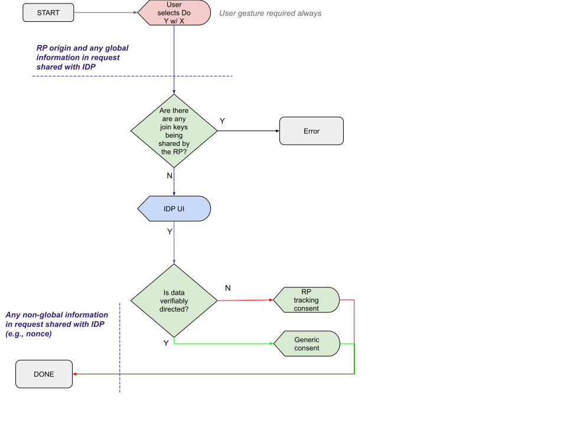

# Permission-oriented API

The philosophy underlying this approach is that browsers should be responsible for ensuring user awareness and permission for cross-site interactions that create tracking risk, and outside of that Relying Parties and Identity Providers should have maximal control of the user experience.

## Permission flow properties
The intention is to prevent [IDP tracking](glossary.md#idp-tracking) by requiring a user gesture on the RP's page before the API can be invoked, and by displaying an appropriate dialog to the user before any identifying user information can be passed from the RP to the IDP. Both of these restrictions can be relaxed if the user agent knows that the user has successfully completed a sign-in with this RP and IDP before.

This flow contains an implicit assumption that 'global' information (including the RP’s origin) can be shared with the IDP based on a user gesture on the RP page. Here 'global' means information that cannot be used to identify a specific user.

In this flow the user agent attempts to mitigate RP tracking by displaying a warning if the IDP is going to provide correlatable user identifiers to the RP. The warning is not shown if the identifier is [verifiably directed](directed_identifiers.md#verifiably-directed-identifiers).

## Benefits
* This should work well across a variety of protocols and use cases without user agents having to accommodate them specifically. 
* In cases where browser state is missing, the only experience downgrade is to have to agree to a cross-origin data sharing permission prompt again.

## Challenges
* The user agent cannot differentiate cases where the IDP gave users the option to use directed identifiers but the user chose not to use them from cases where the user did not have the option to choose directed identifiers at all. In both cases, the data shared back via the browser isn’t verifiably directed and so the browser would require a RP tracking consent step for both.
  * From a UX perspective and ecosystem incentives perspective, we may want to differentiate the experience for each case.
  * This downside is not shared by pure policy based approaches or approaches with browser mediation, i.e., [3].
* Revealing the RP to the IDP becomes a problem if, in the future, privacy restrictions are added on things like referrer on full page navigation.

## Other design options

### Rely on policy-based enforcement instead of directed identifiers
This flow would change minimally if the user agent could accept an IDP's assertion on whether identifiers are directed without them conforming to a verifiable format (i.e. [policy-based enforcement](directed_identifiers.md#policy-based-approach)). This has the benefit of avoiding the [compatibility problems with verifiably directed identifiers](directed_identifiers.md#caveats-of-verifiably-directed-identifiers) but at the drawback of increasing tracking risk from a bad faith IDP.

There is always going to be some level of policy-based requirements, since a bad faith IDP could collude with an RP outside of the defined flows to unmask directed identifiers, but verifiably directed identifiers might make it harder to do that at scale.

### IDP tracking gated on explicit user consent
Another variation is to add a second 'consent moment' where the user grants permission up front for the RP to send a request to the IDP, and at that point IDP tracking becomes possible. The benefit of this approach is that it might be more resilient to future privacy enhancements that make it hard for an RP to initiate a flow where the IDP can learn the RP's origin (or in OIDC terms, client ID). The drawback is that the prompt needs to be before the user is shown IDP UI, necessitating two user agent prompts in some cases, since the RP tracking warning for non-directed identifiers has to come after the IDP UI.

If this permission prompt is added, there is a further question of whether it should apply to an IDP universally (suggesting that the user trusts a given IDP to learn about any sites that offer federated sign-in) or whether the prompt should appear for every IDP+RP pair. In latter case will result in users only rarely seeing such a prompt: only once per IDP, as long as the browser is able to persist that permission. The downside is that it increases user risk if a tracking site can convince the user to grant the permission.
