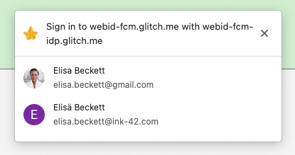
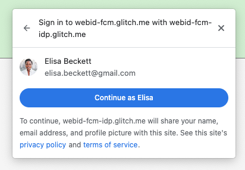

# Proposal for adding webdriver support to FedCM

## Background

[FedCM](https://fedidcg.github.io/FedCM/) is the Federated Credentials
Management API, a new Web Platform API to preserve the “Sign in with X” feature
in a world without third-party cookies.

[Webdriver](https://w3c.github.io/webdriver/) is an automation protocol for web
browsers that can be used for automated testing.

Many developers rely on Webdriver to automate testing of their webapps; in
particular, our current main partner, Google Identity Services (GIS), who
supports “Sign in with Google”, currently relies on it for[ their
testing](https://source.corp.google.com/piper///depot/google3/javatests/com/google/identity/boq/googleidentityservice/web/testing/webdriver/;bpv=0;bpt=0)
and would like to use it for testing the FedCM version of their API.

The obstacle to using webdriver with FedCM is that we open browser UI for the
user to choose an account. We need to provide an extension to webdriver to
allow automated interaction with this dialog (choosing an account or
canceling).


## Requirements

We got IDP feedback as follows.

Quote:

         \
Overall, I think IDP and RPs need two categories of APIs.


        1. Read UI/cooldown status.


        Whether FedCM UI is displayed or not;


        in which page; how many accounts and their order; the UI title/header; TOS/PP link; is auto sign-in started; The time window to cancel; (maybe) the cooldown status.


        2. Interact with the UI controls.


        Ideally, we should be able to interact with any UI controls and verify their behavior. The close 'X' button; the account chips; the 'Continue as XXX' button, the 'Cancel' button on auto sign-in page; The TOS/PP links;


## Precedent

[Secure payments
confirmation](https://w3c.github.io/secure-payment-confirmation/#sctn-automation)
is in a similar situation and has provided an extension to the webdriver
protocol (note that this is not web exposed despite being in the SPC spec):


    The current transaction automation mode tracks what <code>[TransactionAutomationMode](https://w3c.github.io/secure-payment-confirmation/#enumdef-transactionautomationmode)</code> is currently active for SPC. It defaults to "<code>[none](https://w3c.github.io/secure-payment-confirmation/#dom-transactionautomationmode-none)</code>".


```
    enum TransactionAutomationMode {
      "none",
      "autoAccept",
      "autoReject",
      "autoOptOut"
    };


<table>
  <tr>
   <td>```


    <strong>HTTP Method</strong>
   </td>
   <td>
    <strong>URI Template</strong>
   </td>
  </tr>
  <tr>
   <td>
    POST
   </td>
   <td>
    <code>/session/{session id}/secure-payment-confirmation/set-mode</code>
   </td>
  </tr>
</table>


However, per the requirements above, we will need a more complex API.


## Principles

We don’t want to expose every single UI feature of the dialog to webdriver. For
example, while the dialog may allow the user to go back and forth between
different steps of the account selection, we do not want to expose this to
webdriver because this would assume a very specific UI layout and behavior.
This would constrain future UI changes and would be hard or impossible to
implement across browsers or indeed the same browser running on a different OS.
And while Webdriver API changes are not as difficult as changes to web-exposed
APIs, we would like to avoid them as much as possible as this complicates
usage.

As such, we frame things like the “canceldialog” endpoint below as a conceptual
“cancel” and less as a “click the X button”.


## Proposal

We model the proposed API after the Alert API that is part of webdriver:

[https://w3c.github.io/webdriver/#user-prompts](https://w3c.github.io/webdriver/#user-prompts) 

In Java, this can be used together with ExpectedConditions to wait for the
dialog to come up, similar to
[alertIsPresent](https://www.selenium.dev/selenium/docs/api/java/org/openqa/selenium/support/ui/ExpectedConditions.html#alertIsPresent()).
Something like:


```
static ExpectedCondition<FedCmDialog> fedCmDialogIsPresent() {
    return new ExpectedCondition<FedCmDialog>() {
      @Override
      public FedCmDialog apply(WebDriver driver) {
		try {
			return ((HasFedCmDialog) webDriver).getFedCmDialog();
		} catch (NoFedCmDialogPresent) {
			return null;
		}
	}
```


`}` 

Used like:


```
wait.until(fedCmDialogIsPresent());
```

The implementation of getFedCmDialog() will call the accounts list endpoint to check if a dialog is open.

Exposed endpoints (all with a `/session/{session id}/fedcm/` prefix)


<table>
  <tr>
   <td>GET/POST
   </td>
   <td>Name
   </td>
   <td>Description
   </td>
  </tr>
  <tr>
   <td>POST
   </td>
   <td>canceldialog
   </td>
   <td>Cancels the fedcm request as if the user clicked the cancel button
   </td>
  </tr>
  <tr>
   <td>GET
   </td>
   <td>accountlist
   </td>
   <td>If no dialog is open: returns an error
<p>
If a dialog is open: returns an array of {id, profilepic, name, email} objects
   </td>
  </tr>
  <tr>
   <td>GET
   </td>
   <td>consenturls
   </td>
   <td>Parameter: Index of account for which to get the URLs
<p>
Returns a {privacy_policy_url, terms_of_service_url} object, or an error if this is not a sign up dialog
   </td>
  </tr>
  <tr>
   <td>POST
   </td>
   <td>selectaccount
   </td>
   <td>Parameter: Index of account to select
<p>
Selects the given account and closes the dialog
<p>
Returns an error if no dialog is open
   </td>
  </tr>
  <tr>
   <td>POST
   </td>
   <td>openurl
   </td>
   <td>Parameter: Index of account whose URLs should be opened
<p>
Parameter: which URL to open (0=PP, 1=TOS, future: 2=SIGN_IN_TO_IDP?)
<p>
Acts the same way as if the user had clicked one of the URLs
<p>
Returns an error if there is no such URL in the dialog
   </td>
  </tr>
  <tr>
   <td>POST
   </td>
   <td>setdelay
   </td>
   <td>Parameter: Integer indicating the delay used in <a
    href="https://fedidcg.github.io/FedCM/#dom-identitycredential-discoverfromexternalsource-slot">step
    3 of the algorithm</a>, or -1 for the default (to allow the tests to run faster
    when the delay is irrelevant to the test)
   </td>
  </tr>
  <tr>
   <td>GET
   </td>
   <td>gettitle
   </td>
   <td>Returns the dialog title. (This exists so that the <a href="https://bugs.chromium.org/p/chromium/issues/detail?id=1335237">RP context</a> field can be tested)
   </td>
  </tr>
  <tr>
   <td>GET
   </td>
   <td>cooldown
   </td>
   <td>Returns the number of seconds until the dialog can be shown again, or 0 if no cooldown is in effect
   </td>
  </tr>
  <tr>
   <td>POST
   </td>
   <td>setcooldown
   </td>
   <td>Parameter: Number of seconds to set the cooldown to or 0 to disable
   </td>
  </tr>
</table>


openurl and perhaps the getter for the URLs may switch the dialog to the second step:






## Implementation in Chrome

This consists of 3-4 components – addition to CDP; Chromedriver; testdriver.js
(if we want to use it in WPT tests); and the Java API (optional). This is not
counting updating the FedCM spec to specify this new command and the semantics
of the automation mode.


### Java API

This would be useful for automated testing and can be done similar to other
extensions such as
[HasVirtualAuthenticator](https://www.selenium.dev/selenium/docs/api/java/org/openqa/selenium/virtualauthenticator/HasVirtualAuthenticator.html).

Selenium is an open-source project, so we would have to go through their
[contribution
process](https://github.com/SeleniumHQ/selenium/blob/trunk/CONTRIBUTING.md).


### Devtools Protocol (CDP)

Typically Chromedriver implements commands using the devtools protocol. We will
use a similar approach as SPC, [like
here](https://source.chromium.org/chromium/chromium/src/+/main:chrome/browser/devtools/protocol/page_handler.cc;l=86;drc=20965aa5bf539690b30d1da2b5b4cb214f92d86f;bpv=1;bpt=1)
([CL that added
it](https://chromium-review.googlesource.com/c/chromium/src/+/3251001)).


### Chromedriver

Follow the [SPC
code](https://source.chromium.org/chromium/chromium/src/+/main:chrome/test/chromedriver/server/http_handler.cc;l=933)
([CL](https://crrev.com/c/3251001)).


### testdriver.js

Adding support in testdriver.js would let us write more comprehensive WPT
tests, especially tests for the user canceling the request.

Follow the example for SPC
[here](https://source.chromium.org/chromium/chromium/src/+/main:third_party/blink/web_tests/resources/testdriver.js;l=612)
and
[here](https://source.chromium.org/chromium/chromium/src/+/main:third_party/wpt_tools/wpt/tools/wptrunner/wptrunner/testdriver-extra.js;l=256?q=test_driver_internal&ss=chromium)
([CL](https://github.com/web-platform-tests/wpt/commit/ae483100a12ee8e7110c95142f95b14f2d659f6a)).
Some documentation
[here](https://web-platform-tests.org/writing-tests/testdriver-extension-tutorial.html).

Also requires an RFC first, e.g. [https://github.com/web-platform-tests/rfcs/pull/101/files](https://github.com/web-platform-tests/rfcs/pull/101/files) 

Note that despite some of these PRs being in the wpt repository, they do not
affect anything web-exposed; they are just test infrastructure (for allowing
wpt tests to communicate with webdriver)

